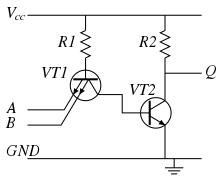
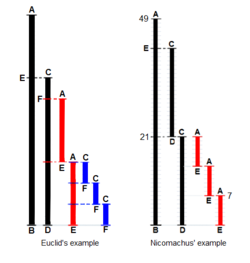
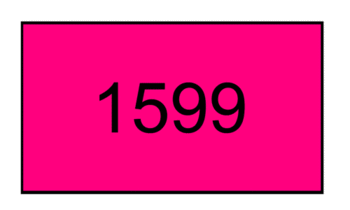
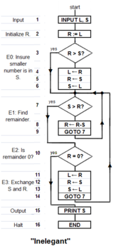

In&nbsp;<a title="Mathematics" href="https://en.wikipedia.org/wiki/Mathematics">mathematics</a>&nbsp;and&nbsp;<a title="Computer science" href="https://en.wikipedia.org/wiki/Computer_science">computer science</a>, an&nbsp;<strong>algorithm</strong>&nbsp;is a finite sequence of&nbsp;<a title="Well-defined" href="https://en.wikipedia.org/wiki/Well-defined">well-defined</a>, computer-implementable instructions, typically to solve a class of problems or to perform a computation.&nbsp;Algorithms are always&nbsp;<a class="mw-redirect" title="Unambiguous" href="https://en.wikipedia.org/wiki/Unambiguous">unambiguous</a>&nbsp;and are used as specifications for performing&nbsp;<a title="Calculation" href="https://en.wikipedia.org/wiki/Calculation">calculations</a>,&nbsp;<a title="Data processing" href="https://en.wikipedia.org/wiki/Data_processing">data processing</a>,&nbsp;<a title="Automated reasoning" href="https://en.wikipedia.org/wiki/Automated_reasoning">automated reasoning</a>, and other tasks.

As an&nbsp;<a title="Effective method" href="https://en.wikipedia.org/wiki/Effective_method">effective method</a>, an algorithm can be expressed within a finite amount of space and time,&nbsp;and in a well-defined formal language&nbsp;for calculating a&nbsp;<a title="Function (mathematics)" href="https://en.wikipedia.org/wiki/Function_(mathematics)">function</a>.&nbsp;Starting from an initial state and initial input (perhaps&nbsp;<a title="Empty string" href="https://en.wikipedia.org/wiki/Empty_string">empty</a>),&nbsp;the instructions describe a&nbsp;<a title="Computation" href="https://en.wikipedia.org/wiki/Computation">computation</a>&nbsp;that, when&nbsp;<a title="Execution (computing)" href="https://en.wikipedia.org/wiki/Execution_(computing)">executed</a>, proceeds through a finite&nbsp;number of well-defined successive states, eventually producing "output"&nbsp;and terminating at a final ending state. The transition from one state to the next is not necessarily&nbsp;<a class="mw-redirect" title="Deterministic" href="https://en.wikipedia.org/wiki/Deterministic">deterministic</a>; some algorithms, known as&nbsp;<a class="mw-redirect" title="Randomized algorithms" href="https://en.wikipedia.org/wiki/Randomized_algorithms">randomized algorithms</a>, incorporate random input.

The concept of algorithm has existed since antiquity.&nbsp;<a title="Arithmetic" href="https://en.wikipedia.org/wiki/Arithmetic">Arithmetic</a>&nbsp;algorithms, such as a&nbsp;<a title="Division algorithm" href="https://en.wikipedia.org/wiki/Division_algorithm">division algorithm</a>, was used by ancient&nbsp;<a title="Babylonian mathematics" href="https://en.wikipedia.org/wiki/Babylonian_mathematics">Babylonian mathematicians</a>&nbsp;c. 2500 BC and&nbsp;<a class="mw-redirect" title="Egyptian mathematics" href="https://en.wikipedia.org/wiki/Egyptian_mathematics">Egyptian mathematicians</a>&nbsp;c. 1550 BC.&nbsp;<a title="Greek mathematics" href="https://en.wikipedia.org/wiki/Greek_mathematics">Greek mathematicians</a>&nbsp;later used algorithms in the&nbsp;<a title="Sieve of Eratosthenes" href="https://en.wikipedia.org/wiki/Sieve_of_Eratosthenes">sieve of Eratosthenes</a>&nbsp;for finding prime numbers,&nbsp;and the&nbsp;<a title="Euclidean algorithm" href="https://en.wikipedia.org/wiki/Euclidean_algorithm">Euclidean algorithm</a>&nbsp;for finding the&nbsp;<a title="Greatest common divisor" href="https://en.wikipedia.org/wiki/Greatest_common_divisor">greatest common divisor</a>&nbsp;of two numbers.&nbsp;<a class="mw-redirect" title="Arabic mathematics" href="https://en.wikipedia.org/wiki/Arabic_mathematics">Arabic mathematicians</a>&nbsp;such as&nbsp;<a title="Al-Kindi" href="https://en.wikipedia.org/wiki/Al-Kindi">Al-Kindi</a>&nbsp;in the 9th century used&nbsp;<a class="mw-redirect" title="Cryptographic" href="https://en.wikipedia.org/wiki/Cryptographic">cryptographic</a>&nbsp;algorithms for&nbsp;<a class="mw-redirect" title="Code-breaking" href="https://en.wikipedia.org/wiki/Code-breaking">code-breaking</a>, based on&nbsp;<a title="Frequency analysis" href="https://en.wikipedia.org/wiki/Frequency_analysis">frequency analysis</a>.

The word&nbsp;<em>algorithm</em>&nbsp;itself is derived from the 9th-century&nbsp;<a class="mw-redirect" title="Persian people" href="https://en.wikipedia.org/wiki/Persian_people">Persian</a>&nbsp;mathematician&nbsp;<a title="Muhammad ibn Musa al-Khwarizmi" href="https://en.wikipedia.org/wiki/Muhammad_ibn_Musa_al-Khwarizmi">Muḥammad ibn Mūsā al-Khwārizmī</a>, Latinized&nbsp;<em>Algoritmi</em>.&nbsp;A partial formalization of what would become the modern concept of algorithm began with attempts to solve the&nbsp;<a title="Entscheidungsproblem" href="https://en.wikipedia.org/wiki/Entscheidungsproblem">Entscheidungsproblem</a>&nbsp;(decision problem) posed by&nbsp;<a title="David Hilbert" href="https://en.wikipedia.org/wiki/David_Hilbert">David Hilbert</a>&nbsp;in 1928. Later formalizations were framed as attempts to define "<a class="mw-redirect" title="Effective calculability" href="https://en.wikipedia.org/wiki/Effective_calculability">effective calculability</a>"&nbsp;or "effective method".<a href="#cite_note-16">[16]</a>&nbsp;Those formalizations included the&nbsp;<a title="Kurt G&ouml;del" href="https://en.wikipedia.org/wiki/Kurt_G%C3%B6del">G&ouml;del</a>&ndash;<a title="Jacques Herbrand" href="https://en.wikipedia.org/wiki/Jacques_Herbrand">Herbrand</a>&ndash;<a title="Stephen Cole Kleene" href="https://en.wikipedia.org/wiki/Stephen_Cole_Kleene">Kleene</a>&nbsp;<a title="Recursion (computer science)" href="https://en.wikipedia.org/wiki/Recursion_(computer_science)">recursive functions</a>&nbsp;of 1930, 1934 and 1935,&nbsp;<a title="Alonzo Church" href="https://en.wikipedia.org/wiki/Alonzo_Church">Alonzo Church</a>'s&nbsp;<a title="Lambda calculus" href="https://en.wikipedia.org/wiki/Lambda_calculus">lambda calculus</a>&nbsp;of 1936,&nbsp;<a class="mw-redirect" title="Emil Post" href="https://en.wikipedia.org/wiki/Emil_Post">Emil Post</a>'s&nbsp;<a class="mw-redirect" title="Formulation 1" href="https://en.wikipedia.org/wiki/Formulation_1">Formulation 1</a>&nbsp;of 1936, and&nbsp;<a title="Alan Turing" href="https://en.wikipedia.org/wiki/Alan_Turing">Alan Turing</a>'s&nbsp;<a class="mw-redirect" title="Turing machines" href="https://en.wikipedia.org/wiki/Turing_machines">Turing machines</a>&nbsp;of 1936&ndash;37 and 1939.

<strong>Contents</strong>

&nbsp;

<ul>
<li class="toclevel-1 tocsection-1"><a href="#Etymology">Etymology</a></li>
<li class="toclevel-1 tocsection-2"><a href="#Informal_definition">Informal definition</a></li>
<li class="toclevel-1 tocsection-3"><a href="#Formalization">Formalization</a>
<ul>
<li class="toclevel-2 tocsection-4"><a href="#Expressing_algorithms">Expressing algorithms</a></li>
</ul>
</li>
<li class="toclevel-1 tocsection-5"><a href="#Design">Design</a></li>
<li class="toclevel-1 tocsection-6"><a href="#Implementation">Implementation</a></li>
<li class="toclevel-1 tocsection-7"><a href="#Computer_algorithms">Computer algorithms</a></li>
<li class="toclevel-1 tocsection-8"><a href="#Examples">Examples</a>
<ul>
<li class="toclevel-2 tocsection-9"><a href="#Algorithm_example">Algorithm example</a></li>
<li class="toclevel-2 tocsection-10"><a href="#Euclid's_algorithm">Euclid's algorithm</a>
<ul>
<li class="toclevel-3 tocsection-11"><a href="#Computer_language_for_Euclid's_algorithm">Computer language for Euclid's algorithm</a></li>
<li class="toclevel-3 tocsection-12"><a href="#An_inelegant_program_for_Euclid's_algorithm">An inelegant program for Euclid's algorithm</a></li>
<li class="toclevel-3 tocsection-13"><a href="#An_elegant_program_for_Euclid's_algorithm">An elegant program for Euclid's algorithm</a></li>
</ul>
</li>
<li class="toclevel-2 tocsection-14"><a href="#Testing_the_Euclid_algorithms">Testing the Euclid algorithms</a></li>
<li class="toclevel-2 tocsection-15"><a href="#Measuring_and_improving_the_Euclid_algorithms">Measuring and improving the Euclid algorithms</a></li>
</ul>
</li>
<li class="toclevel-1 tocsection-16"><a href="#Algorithmic_analysis">Algorithmic analysis</a>
<ul>
<li class="toclevel-2 tocsection-17"><a href="#Formal_versus_empirical">Formal versus empirical</a></li>
<li class="toclevel-2 tocsection-18"><a href="#Execution_efficiency">Execution efficiency</a></li>
</ul>
</li>
<li class="toclevel-1 tocsection-19"><a href="#Classification">Classification</a>
<ul>
<li class="toclevel-2 tocsection-20"><a href="#By_implementation">By implementation</a></li>
<li class="toclevel-2 tocsection-21"><a href="#By_design_paradigm">By design paradigm</a></li>
<li class="toclevel-2 tocsection-22"><a href="#Optimization_problems">Optimization problems</a></li>
<li class="toclevel-2 tocsection-23"><a href="#By_field_of_study">By field of study</a></li>
<li class="toclevel-2 tocsection-24"><a href="#By_complexity">By complexity</a></li>
</ul>
</li>
<li class="toclevel-1 tocsection-25"><a href="#Continuous_algorithms">Continuous algorithms</a></li>
<li class="toclevel-1 tocsection-26"><a href="#Legal_issues">Legal issues</a></li>
<li class="toclevel-1 tocsection-27"><a href="#History:_Development">History: Development of the notion of "algorithm"</a>
<ul>
<li class="toclevel-2 tocsection-28"><a href="#Ancient_Near_East">Ancient Near East</a></li>
<li class="toclevel-2 tocsection-29"><a href="#Discrete_and_distinguishable_symbols">Discrete and distinguishable symbols</a></li>
<li class="toclevel-2 tocsection-30"><a href="#Manipulation_of_symbols">Manipulation of symbols as "place holders" for numbers: algebra</a></li>
<li class="toclevel-2 tocsection-31"><a href="#Cryptographic_algorithms">Cryptographic algorithms</a></li>
<li class="toclevel-2 tocsection-32"><a href="#Mechanical_contrivances_with_discrete_states">Mechanical contrivances with discrete states</a></li>
<li class="toclevel-2 tocsection-33"><a href="#Mathematics_during_the_19th_century_up_to_the_mid-20th_century">Mathematics during the 19th century up to the mid-20th century</a></li>
<li class="toclevel-2 tocsection-34"><a href="#Emil_Post_(1936)_and_Alan_Turing_(1936%E2%80%9337,_1939)">Emil Post (1936) and Alan Turing (1936&ndash;37, 1939)</a></li>
<li class="toclevel-2 tocsection-35"><a href="#J.B._Rosser_(1939)_and_S.C._Kleene_(1943)">J.B. Rosser (1939) and S.C. Kleene (1943)</a></li>
<li class="toclevel-2 tocsection-36"><a href="#History_after_1950">History after 1950</a></li>
</ul>
</li>
 <li class="toclevel-2 tocsection-37"><a href="#Books">Books</a></li> 
  
</ul>
<h2>Etymology</h2>

The word 'algorithm' has its roots in Latinizing the name of Persian mathematician&nbsp;<a title="Muhammad ibn Musa al-Khwarizmi" href="https://en.wikipedia.org/wiki/Muhammad_ibn_Musa_al-Khwarizmi">Muhammad ibn Musa al-Khwarizmi</a>&nbsp;in the first steps to&nbsp;<em>algorismus</em>.&nbsp;Al-Khwārizmī (<a title="Persian language" href="https://en.wikipedia.org/wiki/Persian_language">Persian</a>:&nbsp;خوارزمی&lrm;, c. 780&ndash;850) was a Persian mathematician,&nbsp;<a title="Astronomer" href="https://en.wikipedia.org/wiki/Astronomer">astronomer</a>,&nbsp;<a title="Geographer" href="https://en.wikipedia.org/wiki/Geographer">geographer</a>, and scholar in the&nbsp;<a title="House of Wisdom" href="https://en.wikipedia.org/wiki/House_of_Wisdom">House of Wisdom</a>&nbsp;in&nbsp;<a title="Baghdad" href="https://en.wikipedia.org/wiki/Baghdad">Baghdad</a>,&nbsp;whose name means 'the native of&nbsp;<a title="Khwarazm" href="https://en.wikipedia.org/wiki/Khwarazm">Khwarazm</a>', a region that was part of&nbsp;<a title="Greater Iran" href="https://en.wikipedia.org/wiki/Greater_Iran">Greater Iran</a>&nbsp;and is now in&nbsp;<a title="Uzbekistan" href="https://en.wikipedia.org/wiki/Uzbekistan">Uzbekistan</a>.

About 825, al-Khwarizmi wrote an&nbsp;<a class="mw-redirect" title="Arabic language" href="https://en.wikipedia.org/wiki/Arabic_language">Arabic language</a>&nbsp;treatise on the&nbsp;<a title="Hindu&ndash;Arabic numeral system" href="https://en.wikipedia.org/wiki/Hindu%E2%80%93Arabic_numeral_system">Hindu&ndash;Arabic numeral system</a>, which was translated into&nbsp;<a title="Latin" href="https://en.wikipedia.org/wiki/Latin">Latin</a>&nbsp;during the 12th century under the title&nbsp;<em>Algoritmi de numero Indorum</em>. This title means "Algoritmi on the numbers of the Indians", where "Algoritmi" was the translator's&nbsp;<a title="Latinisation of names" href="https://en.wikipedia.org/wiki/Latinisation_of_names">Latinization</a>&nbsp;of Al-Khwarizmi's name.&nbsp;Al-Khwarizmi was the most widely read mathematician in Europe in the late Middle Ages, primarily through another of his books, the&nbsp;<a class="mw-redirect" title="Al-Jabr" href="https://en.wikipedia.org/wiki/Al-Jabr">Algebra</a>. In late medieval Latin,&nbsp;<em>algorismus</em>, English '<a title="Algorism" href="https://en.wikipedia.org/wiki/Algorism">algorism</a>', the corruption of his name, simply meant the "decimal number system".&nbsp;In the 15th century, under the influence of the Greek word ἀ&rho;&iota;&theta;&mu;ό&sigmaf; 'number' (<em>cf.</em>&nbsp;'arithmetic'), the Latin word was altered to&nbsp;<em>algorithmus</em>, and the corresponding English term 'algorithm' is first attested in the 17th century; the modern sense was introduced in the 19th century.

In English, it was first used in about 1230 and then by&nbsp;<a title="Geoffrey Chaucer" href="https://en.wikipedia.org/wiki/Geoffrey_Chaucer">Chaucer</a>&nbsp;in 1391. English adopted the French term, but it wasn't until the late 19th century that "algorithm" took on the meaning that it has in modern English.

Another early use of the word is from 1240, in a manual titled&nbsp;<em>Carmen de Algorismo</em>&nbsp;composed by&nbsp;<a title="Alexander of Villedieu" href="https://en.wikipedia.org/wiki/Alexander_of_Villedieu">Alexandre de Villedieu</a>. It begins with:

<blockquote class="templatequote">

<em>Haec algorismus ars praesens dicitur, in qua / Talibus Indorum fruimur bis quinque figuris.</em>

</blockquote>

which translates to:

<blockquote class="templatequote">

Algorism is the art by which at present we use those Indian figures, which number two times five.

</blockquote>

The poem is a few hundred lines long and summarizes the art of calculating with the new style of Indian dice, or Talibus Indorum, or Hindu numerals.

<h2>Informal definition</h2>

For a detailed presentation of the various points of view on the definition of "algorithm", see&nbsp;<a title="Algorithm characterizations" href="https://en.wikipedia.org/wiki/Algorithm_characterizations">Algorithm characterizations</a>.

An informal definition could be "a set of rules that precisely defines a sequence of operations",&nbsp;which would include all computer programs, including programs that do not perform numeric calculations, and (for example) any prescribed&nbsp;<a class="mw-redirect" title="Bureaucratic" href="https://en.wikipedia.org/wiki/Bureaucratic">bureaucratic</a>&nbsp;procedure.&nbsp;In general, a program is only an algorithm if it stops eventually.

A prototypical example of an algorithm is the&nbsp;<a title="Euclidean algorithm" href="https://en.wikipedia.org/wiki/Euclidean_algorithm">Euclidean algorithm</a>, which is used to determine the maximum common divisor of two integers; an example (there are others) is described by the&nbsp;<a title="Flowchart" href="https://en.wikipedia.org/wiki/Flowchart">flowchart</a>&nbsp;above and as an example in a later section.

<a href="#CITEREFBoolosJeffrey1999">Boolos, Jeffrey &amp; 1974, 1999</a>&nbsp;offer an informal meaning of the word "algorithm" in the following quotation:

<blockquote>

No human being can write fast enough, or long enough, or small enough&dagger; ( &dagger;"smaller and smaller without limit &hellip; you'd be trying to write on molecules, on atoms, on electrons") to list all members of an enumerably infinite set by writing out their names, one after another, in some notation. But humans can do something equally useful, in the case of certain enumerably infinite sets: They can give&nbsp;<em>explicit instructions for determining the&nbsp;<strong>n</strong>th member of the set</em>, for arbitrary finite&nbsp;<em>n</em>. Such instructions are to be given quite explicitly, in a form in which&nbsp;<em>they could be followed by a computing machine</em>, or by a&nbsp;<em>human who is capable of carrying out only very elementary operations on symbols.</em>

</blockquote>

An "<a title="Recursively enumerable set" href="https://en.wikipedia.org/wiki/Recursively_enumerable_set">enumerably infinite set</a>" is one whose elements can be put into one-to-one correspondence with the integers. Thus, Boolos and Jeffrey are saying that an algorithm implies instructions for a process that "creates" output integers from an&nbsp;<em>arbitrary</em>&nbsp;"input" integer or integers that, in theory, can be arbitrarily large. For example, an algorithm can be an algebraic equation such as&nbsp;<em>y = m + n</em>&nbsp;(i.e., two arbitrary "input variables"&nbsp;<em>m</em>&nbsp;and&nbsp;<em>n</em>&nbsp;that produce an output&nbsp;<em>y</em>), but various authors' attempts to define the notion indicate that the word implies much more than this, something on the order of (for the addition example):

<dl>
<dd>Precise instructions (in language understood by "the computer")&nbsp;for a fast, efficient, "good"&nbsp;process that specifies the "moves" of "the computer" (machine or human, equipped with the necessary internally contained information and capabilities)&nbsp;to find, decode, and then process arbitrary input integers/symbols&nbsp;<em>m</em>&nbsp;and&nbsp;<em>n</em>, symbols&nbsp;<em>+</em>&nbsp;and&nbsp;<em>=</em>&nbsp;&hellip; and "effectively"&nbsp;produce, in a "reasonable" time,&nbsp;output-integer&nbsp;<em>y</em>&nbsp;at a specified place and in a specified format.</dd>
</dl>

The concept of&nbsp;<em>algorithm</em>&nbsp;is also used to define the notion of&nbsp;<a title="Decidability (logic)" href="https://en.wikipedia.org/wiki/Decidability_(logic)">decidability</a>&mdash;a notion that is central for explaining how&nbsp;<a title="Formal system" href="https://en.wikipedia.org/wiki/Formal_system">formal systems</a>&nbsp;come into being starting from a small set of&nbsp;<a title="Axiom" href="https://en.wikipedia.org/wiki/Axiom">axioms</a>&nbsp;and rules. In&nbsp;<a title="Logic" href="https://en.wikipedia.org/wiki/Logic">logic</a>, the time that an algorithm requires to complete cannot be measured, as it is not apparently related to the customary physical dimension. From such uncertainties, that characterize ongoing work, stems the unavailability of a definition of&nbsp;<em>algorithm</em>&nbsp;that suits both concrete (in some sense) and abstract usage of the term.

<h2>Formalization</h2>

Algorithms are essential to the way computers process data. Many computer programs contain algorithms that detail the specific instructions a computer should perform&mdash;in a specific order&mdash;to carry out a specified task, such as calculating employees' paychecks or printing students' report cards. Thus, an algorithm can be considered to be any sequence of operations that can be simulated by a&nbsp;<a title="Turing reduction" href="https://en.wikipedia.org/wiki/Turing_reduction">Turing-complete</a>&nbsp;system. Authors who assert this thesis include Minsky (1967), Savage (1987) and Gurevich (2000):

<blockquote>

Minsky: "But we will also maintain, with Turing &hellip; that any procedure which could "naturally" be called effective, can, in fact, be realized by a (simple) machine. Although this may seem extreme, the arguments &hellip; in its favor are hard to refute".

</blockquote>
<blockquote>

Gurevich: &ldquo;&hellip; Turing's informal argument in favor of his thesis justifies a stronger thesis: every algorithm can be simulated by a Turing machine &hellip; according to Savage [1987], an algorithm is a computational process defined by a Turing machine".

</blockquote>

Turing machines can define computational processes that do not terminate. The informal definitions of algorithms generally require that the algorithm always terminates. This requirement renders the task of deciding whether a formal procedure is an algorithm impossible in the general case&mdash;due to a major theorem of&nbsp;<a title="Computability theory" href="https://en.wikipedia.org/wiki/Computability_theory">computability theory</a>&nbsp;known as the&nbsp;<a title="Halting problem" href="https://en.wikipedia.org/wiki/Halting_problem">halting problem</a>.

Typically, when an algorithm is associated with processing information, data can be read from an input source, written to an output device and stored for further processing. Stored data are regarded as part of the internal state of the entity performing the algorithm. In practice, the state is stored in one or more&nbsp;<a title="Data structure" href="https://en.wikipedia.org/wiki/Data_structure">data structures</a>.

For some of these computational process, the algorithm must be rigorously defined: specified in the way it applies in all possible circumstances that could arise. This means that any conditional steps must be systematically dealt with, case-by-case; the criteria for each case must be clear (and computable).

Because an algorithm is a precise list of precise steps, the order of computation is always crucial to the functioning of the algorithm. Instructions are usually assumed to be listed explicitly, and are described as starting "from the top" and going "down to the bottom"&mdash;an idea that is described more formally by&nbsp;<em><a title="Control flow" href="https://en.wikipedia.org/wiki/Control_flow">flow of control</a></em>.

So far, the discussion on the formalization of an algorithm has assumed the premises of&nbsp;<a title="Imperative programming" href="https://en.wikipedia.org/wiki/Imperative_programming">imperative programming</a>. This is the most common conception&mdash;one which attempts to describe a task in discrete, "mechanical" means. Unique to this conception of formalized algorithms is the&nbsp;<a class="mw-redirect" title="Assignment operation" href="https://en.wikipedia.org/wiki/Assignment_operation">assignment operation</a>, which sets the value of a variable. It derives from the intuition of "<a title="Memory" href="https://en.wikipedia.org/wiki/Memory">memory</a>" as a scratchpad. An example of such an assignment can be found below.

For some alternate conceptions of what constitutes an algorithm, see&nbsp;<a title="Functional programming" href="https://en.wikipedia.org/wiki/Functional_programming">functional programming</a>&nbsp;and&nbsp;<a title="Logic programming" href="https://en.wikipedia.org/wiki/Logic_programming">logic programming</a>.

<h3>Expressing algorithms</h3>

Algorithms can be expressed in many kinds of notation, including&nbsp;<a title="Natural language" href="https://en.wikipedia.org/wiki/Natural_language">natural languages</a>,&nbsp;<a title="Pseudocode" href="https://en.wikipedia.org/wiki/Pseudocode">pseudocode</a>,&nbsp;<a title="Flowchart" href="https://en.wikipedia.org/wiki/Flowchart">flowcharts</a>,&nbsp;<a title="DRAKON" href="https://en.wikipedia.org/wiki/DRAKON">drakon-charts</a>,&nbsp;<a title="Programming language" href="https://en.wikipedia.org/wiki/Programming_language">programming languages</a>&nbsp;or&nbsp;<a title="Control table" href="https://en.wikipedia.org/wiki/Control_table">control tables</a>&nbsp;(processed by&nbsp;<a title="Interpreter (computing)" href="https://en.wikipedia.org/wiki/Interpreter_(computing)">interpreters</a>). Natural language expressions of algorithms tend to be verbose and ambiguous, and are rarely used for complex or technical algorithms. Pseudocode, flowcharts,&nbsp;<a title="DRAKON" href="https://en.wikipedia.org/wiki/DRAKON">drakon-charts</a>&nbsp;and control tables are structured ways to express algorithms that avoid many of the ambiguities common in the statements based on natural language. Programming languages are primarily intended for expressing algorithms in a form that can be executed by a computer, but are also often used as a way to define or document algorithms.

There is a wide variety of representations possible and one can express a given&nbsp;<a title="Turing machine" href="https://en.wikipedia.org/wiki/Turing_machine">Turing machine</a>&nbsp;program as a sequence of machine tables, as flowcharts and&nbsp;<a title="DRAKON" href="https://en.wikipedia.org/wiki/DRAKON">drakon-charts</a>&nbsp;, or as a form of rudimentary&nbsp;<a title="Machine code" href="https://en.wikipedia.org/wiki/Machine_code">machine code</a>&nbsp;or&nbsp;<a class="mw-redirect" title="Assembly code" href="https://en.wikipedia.org/wiki/Assembly_code">assembly code</a>&nbsp;called "sets of quadruples".

Representations of algorithms can be classed into three accepted levels of Turing machine description, as follows:

<dl>
<dt>1 High-level description</dt>
<dd>&ldquo;&hellip;prose to describe an algorithm, ignoring the implementation details. At this level, we do not need to mention how the machine manages its tape or head."</dd>
<dt>2 Implementation description</dt>
<dd>&ldquo;&hellip;prose used to define the way the Turing machine uses its head and the way that it stores data on its tape. At this level, we do not give details of states or transition function."</dd>
<dt>3 Formal description</dt>
<dd>Most detailed, "lowest level", gives the Turing machine's "state table".</dd>
</dl>

For an example of the simple algorithm "Add m+n" described in all three levels, see&nbsp;<a title="Algorithm" href="#Examples">Algorithm#Examples</a>.

<h2>Design</h2>

&nbsp;

Algorithm design refers to a method or a mathematical process for problem-solving and engineering algorithms. The design of algorithms is part of many solution theories of&nbsp;<a class="mw-redirect" title="Operation research" href="https://en.wikipedia.org/wiki/Operation_research">operation research</a>, such as&nbsp;<a title="Dynamic programming" href="https://en.wikipedia.org/wiki/Dynamic_programming">dynamic programming</a>&nbsp;and&nbsp;<a class="mw-redirect" title="Divide and conquer algorithm" href="https://en.wikipedia.org/wiki/Divide_and_conquer_algorithm">divide-and-conquer</a>. Techniques for designing and implementing algorithm designs are also called algorithm design patterns,&nbsp;with examples including the template method pattern and the decorator pattern.

One of the most important aspects of algorithm design lies in the creation of algorithm that has an efficient run-time, also known as its&nbsp;<a title="Big O notation" href="https://en.wikipedia.org/wiki/Big_O_notation">Big O</a>.

Typical steps in the development of algorithms:

<ol>
<li>Problem definition</li>
<li>Development of a model</li>
<li>Specification of the algorithm</li>
<li>Designing an algorithm</li>
<li>Checking the&nbsp;<a title="Correctness (computer science)" href="https://en.wikipedia.org/wiki/Correctness_(computer_science)">correctness</a>&nbsp;of the algorithm</li>
<li>Analysis of algorithm</li>
<li>Implementation of algorithm</li>
<li>Program testing</li>
<li>Documentation preparation</li>
</ol>
<h2>Implementation</h2>

&nbsp;

<a class="mw-redirect" title="Logical NAND" href="https://en.wikipedia.org/wiki/Logical_NAND">Logical NAND</a>&nbsp;algorithm implemented electronically in&nbsp;<a class="mw-redirect" title="7400 series" href="https://en.wikipedia.org/wiki/7400_series">7400</a>&nbsp;chip

&nbsp;

Most algorithms are intended to be implemented as&nbsp;<a class="mw-redirect" title="Computer programs" href="https://en.wikipedia.org/wiki/Computer_programs">computer programs</a>. However, algorithms are also implemented by other means, such as in a&nbsp;<a class="mw-redirect" title="Biological neural network" href="https://en.wikipedia.org/wiki/Biological_neural_network">biological neural network</a>&nbsp;(for example, the&nbsp;<a title="Human brain" href="https://en.wikipedia.org/wiki/Human_brain">human brain</a>&nbsp;implementing&nbsp;<a title="Arithmetic" href="https://en.wikipedia.org/wiki/Arithmetic">arithmetic</a>&nbsp;or an insect looking for food), in an&nbsp;<a class="mw-redirect" title="Electrical circuit" href="https://en.wikipedia.org/wiki/Electrical_circuit">electrical circuit</a>, or in a mechanical device.

<h2>Computer algorithms</h2>

&nbsp;

Flowchart examples of the canonical&nbsp;<a title="Structured program theorem" href="https://en.wikipedia.org/wiki/Structured_program_theorem">B&ouml;hm-Jacopini structures</a>: the SEQUENCE (rectangles descending the page), the WHILE-DO and the IF-THEN-ELSE. The three structures are made of the primitive conditional GOTO (<code id="" class="mw-highlight mw-highlight-lang-text" dir="ltr">{{{1}}}</code>) (a diamond), the unconditional GOTO (rectangle), various assignment operators (rectangle), and HALT (rectangle). Nesting of these structures inside assignment-blocks result in complex diagrams (cf Tausworthe 1977:100, 114).

&nbsp;

&nbsp;

In&nbsp;<a class="mw-redirect" title="Computer systems" href="https://en.wikipedia.org/wiki/Computer_systems">computer systems</a>, an algorithm is basically an instance of&nbsp;<a title="Logic" href="https://en.wikipedia.org/wiki/Logic">logic</a>&nbsp;written in software by software developers, to be effective for the intended "target" computer(s) to produce&nbsp;<em>output</em>&nbsp;from given (perhaps null)&nbsp;<em>input</em>. An optimal algorithm, even running in old hardware, would produce faster results than a non-optimal (higher&nbsp;<a title="Time complexity" href="https://en.wikipedia.org/wiki/Time_complexity">time complexity</a>) algorithm for the same purpose, running in more efficient hardware; that is why algorithms, like computer hardware, are considered technology.

<em>"Elegant" (compact) programs, "good" (fast) programs&nbsp;</em>: The notion of "simplicity and elegance" appears informally in&nbsp;<a title="Donald Knuth" href="https://en.wikipedia.org/wiki/Donald_Knuth">Knuth</a>&nbsp;and precisely in&nbsp;<a title="Gregory Chaitin" href="https://en.wikipedia.org/wiki/Gregory_Chaitin">Chaitin</a>:

<dl>
<dd>Knuth: " &hellip; we want&nbsp;<em>good</em>&nbsp;algorithms in some loosely defined aesthetic sense. One criterion &hellip; is the length of time taken to perform the algorithm &hellip;. Other criteria are adaptability of the algorithm to computers, its simplicity and elegance, etc"</dd>
</dl>
<dl>
<dd>Chaitin: " &hellip; a program is 'elegant,' by which I mean that it's the smallest possible program for producing the output that it does"</dd>
</dl>

Chaitin prefaces his definition with: "I'll show you can't prove that a program is 'elegant'"&mdash;such a proof would solve the&nbsp;<a title="Halting problem" href="https://en.wikipedia.org/wiki/Halting_problem">Halting problem</a>&nbsp;(ibid).

<em>Algorithm versus function computable by an algorithm</em>: For a given function multiple algorithms may exist. This is true, even without expanding the available instruction set available to the programmer. Rogers observes that "It is ... important to distinguish between the notion of&nbsp;<em>algorithm</em>, i.e. procedure and the notion of&nbsp;<em>function computable by algorithm</em>, i.e. mapping yielded by procedure. The same function may have several different algorithms".

Unfortunately, there may be a tradeoff between goodness (speed) and elegance (compactness)&mdash;an elegant program may take more steps to complete a computation than one less elegant. An example that uses Euclid's algorithm appears below.

<em>Computers (and computors), models of computation</em>: A computer (or human "computor") is a restricted type of machine, a "discrete deterministic mechanical device"&nbsp;that blindly follows its instructions.&nbsp;Melzak's and Lambek's primitive models&nbsp;reduced this notion to four elements: (i) discrete, distinguishable&nbsp;<em>locations</em>, (ii) discrete, indistinguishable&nbsp;<em>counters</em>&nbsp;(iii) an agent, and (iv) a list of instructions that are&nbsp;<em>effective</em>&nbsp;relative to the capability of the agent.

Minsky describes a more congenial variation of Lambek's "abacus" model in his "Very Simple Bases for&nbsp;<a title="Computability" href="https://en.wikipedia.org/wiki/Computability">Computability</a>".&nbsp;<a class="mw-redirect" title="Minsky machine" href="https://en.wikipedia.org/wiki/Minsky_machine">Minsky's machine</a>&nbsp;proceeds sequentially through its five (or six, depending on how one counts) instructions, unless either a conditional IF&ndash;THEN GOTO or an unconditional GOTO changes program flow out of sequence. Besides HALT, Minsky's machine includes three&nbsp;<em>assignment</em>&nbsp;(replacement, substitution)&nbsp;operations: ZERO (e.g. the contents of location replaced by 0: L &larr; 0), SUCCESSOR (e.g. L &larr; L+1), and DECREMENT (e.g. L &larr; L &minus; 1).&nbsp;Rarely must a programmer write "code" with such a limited instruction set. But Minsky shows (as do Melzak and Lambek) that his machine is&nbsp;<a class="mw-redirect" title="Turing complete" href="https://en.wikipedia.org/wiki/Turing_complete">Turing complete</a>&nbsp;with only four general&nbsp;<em>types</em>&nbsp;of instructions: conditional GOTO, unconditional GOTO, assignment/replacement/substitution, and HALT. However, a few different assignment instructions (e.g. DECREMENT, INCREMENT, and ZERO/CLEAR/EMPTY for a Minsky machine) are also required for Turing-completeness; their exact specification is somewhat up to the designer. The unconditional GOTO is a convenience; it can be constructed by initializing a dedicated location to zero e.g. the instruction " Z &larr; 0 "; thereafter the instruction IF Z=0 THEN GOTO xxx is unconditional.

<em>Simulation of an algorithm: computer (computor) language</em>: Knuth advises the reader that "the best way to learn an algorithm is to try it . . . immediately take pen and paper and work through an example".&nbsp;But what about a simulation or execution of the real thing? The programmer must translate the algorithm into a language that the simulator/computer/computor can&nbsp;<em>effectively</em>&nbsp;execute. Stone gives an example of this: when computing the roots of a quadratic equation the computor must know how to take a square root. If they don't, then the algorithm, to be effective, must provide a set of rules for extracting a square root.

This means that the programmer must know a "language" that is effective relative to the target computing agent (computer/computor).

But what model should be used for the simulation? Van Emde Boas observes "even if we base&nbsp;<a title="Computational complexity theory" href="https://en.wikipedia.org/wiki/Computational_complexity_theory">complexity theory</a>&nbsp;on abstract instead of concrete machines, arbitrariness of the choice of a model remains. It is at this point that the notion of&nbsp;<em>simulation</em>&nbsp;enters".&nbsp;When speed is being measured, the instruction set matters. For example, the subprogram in Euclid's algorithm to compute the remainder would execute much faster if the programmer had a "<a title="Modular arithmetic" href="https://en.wikipedia.org/wiki/Modular_arithmetic">modulus</a>" instruction available rather than just subtraction (or worse: just Minsky's "decrement").

<em>Structured programming, canonical structures</em>: Per the&nbsp;<a title="Church&ndash;Turing thesis" href="https://en.wikipedia.org/wiki/Church%E2%80%93Turing_thesis">Church&ndash;Turing thesis</a>, any algorithm can be computed by a model known to be&nbsp;<a class="mw-redirect" title="Turing complete" href="https://en.wikipedia.org/wiki/Turing_complete">Turing complete</a>, and per Minsky's demonstrations, Turing completeness requires only four instruction types&mdash;conditional GOTO, unconditional GOTO, assignment, HALT. Kemeny and Kurtz observe that, while "undisciplined" use of unconditional GOTOs and conditional IF-THEN GOTOs can result in "<a title="Spaghetti code" href="https://en.wikipedia.org/wiki/Spaghetti_code">spaghetti code</a>", a programmer can write structured programs using only these instructions; on the other hand "it is also possible, and not too hard, to write badly structured programs in a structured language".&nbsp;Tausworthe augments the three&nbsp;<a title="Structured program theorem" href="https://en.wikipedia.org/wiki/Structured_program_theorem">B&ouml;hm-Jacopini canonical structures</a>:&nbsp;SEQUENCE, IF-THEN-ELSE, and WHILE-DO, with two more: DO-WHILE and CASE.&nbsp;An additional benefit of a structured program is that it lends itself to&nbsp;<a class="mw-redirect" title="Proof of correctness" href="https://en.wikipedia.org/wiki/Proof_of_correctness">proofs of correctness</a>&nbsp;using&nbsp;<a title="Mathematical induction" href="https://en.wikipedia.org/wiki/Mathematical_induction">mathematical induction</a>.

<em>Canonical flowchart symbols</em>: The graphical aide called a&nbsp;<a title="Flowchart" href="https://en.wikipedia.org/wiki/Flowchart">flowchart</a>, offers a way to describe and document an algorithm (and a computer program of one). Like the program flow of a Minsky machine, a flowchart always starts at the top of a page and proceeds down. Its primary symbols are only four: the directed arrow showing program flow, the rectangle (SEQUENCE, GOTO), the diamond (IF-THEN-ELSE), and the dot (OR-tie). The B&ouml;hm&ndash;Jacopini canonical structures are made of these primitive shapes. Sub-structures can "nest" in rectangles, but only if a single exit occurs from the superstructure. The symbols, and their use to build the canonical structures are shown in the diagram.

<h2>Examples</h2>
<h3>Algorithm example</h3>

One of the simplest algorithms is to find the largest number in a list of numbers of random order. Finding the solution requires looking at every number in the list. From this follows a simple algorithm, which can be stated in a high-level description in English prose, as:

<em>High-level description:</em>

<ol>
<li>If there are no numbers in the set then there is no highest number.</li>
<li>Assume the first number in the set is the largest number in the set.</li>
<li>For each remaining number in the set: if this number is larger than the current largest number, consider this number to be the largest number in the set.</li>
<li>When there are no numbers left in the set to iterate over, consider the current largest number to be the largest number of the set.</li>
</ol>

<em>(Quasi-)formal description:</em>&nbsp;Written in prose but much closer to the high-level language of a computer program, the following is the more formal coding of the algorithm in&nbsp;<a title="Pseudocode" href="https://en.wikipedia.org/wiki/Pseudocode">pseudocode</a>&nbsp;or&nbsp;<a title="Pidgin code" href="https://en.wikipedia.org/wiki/Pidgin_code">pidgin code</a>:

<pre><strong>Algorithm</strong> LargestNumber
  Input: A list of numbers <em>L</em>.
  Output: The largest number in the list <em>L</em>.
</pre>
<pre>  <strong>if</strong> <em>L.size</em> = 0 <strong>return</strong> null
  <em>largest</em> &larr; <em>L</em>[0]
  <strong>for each</strong> <em>item</em> <strong>in</strong> <em>L</em>, <strong>do</strong>
    <strong>if</strong> <em>item</em> &gt; <em>largest</em>, <strong>then</strong>
      <em>largest</em> &larr; <em>item</em>
  <strong>return</strong> <em>largest</em>
</pre>
<ul>
<li><small>"&larr;" denotes&nbsp;<a title="Assignment (computer science)" href="https://en.wikipedia.org/wiki/Assignment_(computer_science)">assignment</a>. For instance, "<em>largest</em>&nbsp;&larr;&nbsp;<em>item</em>" means that the value of&nbsp;<em>largest</em>&nbsp;changes to the value of&nbsp;<em>item</em>.</small></li>
<li><small>"<strong>return</strong>" terminates the algorithm and outputs the following value.</small></li>
</ul>

<h3>Euclid's algorithm</h3>

&nbsp;

&nbsp;

The example-diagram of Euclid's algorithm from T.L. Heath (1908), with more detail added. Euclid does not go beyond a third measuring and gives no numerical examples. Nicomachus gives the example of 49 and 21: "I subtract the less from the greater; 28 is left; then again I subtract from this the same 21 (for this is possible); 7 is left; I subtract this from 21, 14 is left; from which I again subtract 7 (for this is possible); 7 is left, but 7 cannot be subtracted from 7." Heath comments that "The last phrase is curious, but the meaning of it is obvious enough, as also the meaning of the phrase about ending 'at one and the same number'."(Heath 1908:300).

<a title="Euclid" href="https://en.wikipedia.org/wiki/Euclid">Euclid</a>'s algorithm to compute the&nbsp;<a title="Greatest common divisor" href="https://en.wikipedia.org/wiki/Greatest_common_divisor">greatest common divisor</a>&nbsp;(GCD) to two numbers appears as Proposition II in Book VII ("Elementary Number Theory") of his&nbsp;<em><a title="Euclid's Elements" href="https://en.wikipedia.org/wiki/Euclid%27s_Elements">Elements</a></em>.&nbsp;Euclid poses the problem thus: "Given two numbers not prime to one another, to find their greatest common measure". He defines "A number [to be] a multitude composed of units": a counting number, a positive integer not including zero. To "measure" is to place a shorter measuring length&nbsp;<em>s</em>&nbsp;successively (<em>q</em>&nbsp;times) along longer length&nbsp;<em>l</em>&nbsp;until the remaining portion&nbsp;<em>r</em>&nbsp;is less than the shorter length&nbsp;<em>s</em>.&nbsp;In modern words, remainder&nbsp;<em>r</em>&nbsp;=&nbsp;<em>l</em>&nbsp;&minus;&nbsp;<em>q</em>&times;<em>s</em>,&nbsp;<em>q</em>&nbsp;being the quotient, or remainder&nbsp;<em>r</em>&nbsp;is the "modulus", the integer-fractional part left over after the division.

For Euclid's method to succeed, the starting lengths must satisfy two requirements: (i) the lengths must not be zero, AND (ii) the subtraction must be &ldquo;proper&rdquo;; i.e., a test must guarantee that the smaller of the two numbers is subtracted from the larger (or the two can be equal so their subtraction yields zero).

Euclid's original proof adds a third requirement: the two lengths must not be prime to one another. Euclid stipulated this so that he could construct a&nbsp;<a title="Reductio ad absurdum" href="https://en.wikipedia.org/wiki/Reductio_ad_absurdum">reductio ad absurdum</a>&nbsp;proof that the two numbers' common measure is in fact the&nbsp;<em>greatest</em>.&nbsp;While Nicomachus' algorithm is the same as Euclid's, when the numbers are prime to one another, it yields the number "1" for their common measure. So, to be precise, the following is really Nicomachus' algorithm.

&nbsp;

A graphical expression of Euclid's algorithm to find the greatest common divisor for 1599 and 650.

<pre> 1599 = 650&times;2 + 299
 650 = 299&times;2 + 52
 299 = 52&times;5 + 39
 52 = 39&times;1 + 13
 39 = 13&times;3 + 0
</pre>

<h4>Computer language for Euclid's algorithm</h4>

Only a few instruction&nbsp;<em>types</em>&nbsp;are required to execute Euclid's algorithm&mdash;some logical tests (conditional GOTO), unconditional GOTO, assignment (replacement), and subtraction.

<ul>
<li>A&nbsp;<em>location</em>&nbsp;is symbolized by upper case letter(s), e.g. S, A, etc.</li>
<li>The varying quantity (number) in a location is written in lower case letter(s) and (usually) associated with the location's name. For example, location L at the start might contain the number&nbsp;<em>l</em>&nbsp;= 3009.</li>
</ul>
<h4>An inelegant program for Euclid's algorithm</h4>

&nbsp;

"Inelegant" is a translation of Knuth's version of the algorithm with a subtraction-based remainder-loop replacing his use of division (or a "modulus" instruction). Derived from Knuth 1973:2&ndash;4. Depending on the two numbers "Inelegant" may compute the g.c.d. in fewer steps than "Elegant".

The following algorithm is framed as Knuth's four-step version of Euclid's and Nicomachus', but, rather than using division to find the remainder, it uses successive subtractions of the shorter length&nbsp;<em>s</em>&nbsp;from the remaining length&nbsp;<em>r</em>&nbsp;until&nbsp;<em>r</em>&nbsp;is less than&nbsp;<em>s</em>. The high-level description, shown in boldface, is adapted from Knuth 1973:2&ndash;4:

<strong>INPUT</strong>:

<pre>1 [Into two locations L and S put the numbers <em>l</em> and <em>s</em> that represent the two lengths]:
  INPUT L, S
2 [Initialize R: make the remaining length <em>r</em> equal to the starting/initial/input length <em>l</em>]:
  R &larr; L
</pre>

<strong>E0: [Ensure&nbsp;<em>r</em>&nbsp;&ge;&nbsp;<em>s</em>.]</strong>

<pre>3 [Ensure the smaller of the two numbers is in S and the larger in R]:
  IF R &gt; S THEN
    the contents of L is the larger number so skip over the exchange-steps <a href="#4">4</a>, <a href="#5">5</a> and <a href="#6">6</a>:
    GOTO step <a href="#6">6</a>
  ELSE
    swap the contents of R and S.
4   L &larr; R (this first step is redundant, but is useful for later discussion).
5   R &larr; S
6   S &larr; L
</pre>

<strong>E1: [Find remainder]</strong>: Until the remaining length&nbsp;<em>r</em>&nbsp;in R is less than the shorter length&nbsp;<em>s</em>&nbsp;in S, repeatedly subtract the measuring number&nbsp;<em>s</em>&nbsp;in S from the remaining length&nbsp;<em>r</em>&nbsp;in R.

<pre>7 IF S &gt; R THEN
    done measuring so
    GOTO <a href="#10">10</a>
  ELSE
    measure again,
8   R &larr; R &minus; S
9   [Remainder-loop]:
    GOTO <a href="#7">7</a>.
</pre>

<strong>E2: [Is the remainder zero?]</strong>: EITHER (i) the last measure was exact, the remainder in R is zero, and the program can halt, OR (ii) the algorithm must continue: the last measure left a remainder in R less than measuring number in S.

<pre>10 IF R = 0 THEN
     done so
     GOTO <a href="#15">step 15</a>
   ELSE
     CONTINUE TO <a href="#11">step 11</a>,
</pre>

<strong>E3: [Interchange&nbsp;<em>s</em>&nbsp;and&nbsp;<em>r</em>]</strong>: The nut of Euclid's algorithm. Use remainder&nbsp;<em>r</em>&nbsp;to measure what was previously smaller number&nbsp;<em>s</em>; L serves as a temporary location.

<pre>11  L &larr; R
12  R &larr; S
13  S &larr; L
14  [Repeat the measuring process]:
    GOTO <a href="#7">7</a>
</pre>

<strong>OUTPUT</strong>:

<pre>15 [Done. S contains the <a title="Greatest common divisor" href="https://en.wikipedia.org/wiki/Greatest_common_divisor">greatest common divisor</a>]:
   PRINT S
</pre>

<strong>DONE</strong>:

<pre>16 HALT, END, STOP.
</pre>
<h4>An elegant program for Euclid's algorithm</h4>

The following version of Euclid's algorithm requires only six core instructions to do what thirteen are required to do by "Inelegant"; worse, "Inelegant" requires more&nbsp;<em>types</em>&nbsp;of instructions.&nbsp;The flowchart of "Elegant" can be found at the top of this article. In the (unstructured) Basic language, the steps are numbered, and the instruction&nbsp;<code class="mw-highlight mw-highlight-lang-cbmbas" dir="ltr">LET&nbsp;[]&nbsp;=&nbsp;[]</code>&nbsp;is the assignment instruction symbolized by &larr;.

<pre>  5 REM Euclid's algorithm for greatest common divisor
  6 PRINT "Type two integers greater than 0"
  10 INPUT A,B
  20 IF B=0 THEN GOTO 80
  30 IF A &gt; B THEN GOTO 60
  40 LET B=B-A
  50 GOTO 20
  60 LET A=A-B
  70 GOTO 20
  80 PRINT A
  90 END
</pre>

<em>How "Elegant" works</em>: In place of an outer "Euclid loop", "Elegant" shifts back and forth between two "co-loops", an A &gt; B loop that computes A &larr; A &minus; B, and a B &le; A loop that computes B &larr; B &minus; A. This works because, when at last the minuend M is less than or equal to the subtrahend S (Difference = Minuend &minus; Subtrahend), the minuend can become&nbsp;<em>s</em>&nbsp;(the new measuring length) and the subtrahend can become the new&nbsp;<em>r</em>&nbsp;(the length to be measured); in other words the "sense" of the subtraction reverses.

The following version can be used with&nbsp;<a title="Object-oriented programming" href="https://en.wikipedia.org/wiki/Object-oriented_programming">object-oriented languages</a>:

<pre>// Euclid's algorithm for greatest common divisor
int euclidAlgorithm (int A, int B){
     A=Math.abs(A);
     B=Math.abs(B);
     while (B!=0){
          if (A&gt;B) A=A-B;
          else B=B-A;
     }
     return A;
}
</pre>

<h3>Testing the Euclid algorithms</h3>

Does an algorithm do what its author wants it to do? A few test cases usually give some confidence in the core functionality. But tests are not enough. For test cases, one source&nbsp;uses 3009 and 884. Knuth suggested 40902, 24140. Another interesting case is the two&nbsp;<a class="mw-redirect" title="Relatively prime" href="https://en.wikipedia.org/wiki/Relatively_prime">relatively prime</a>&nbsp;numbers 14157 and 5950.

But "exceptional cases"&nbsp;must be identified and tested. Will "Inelegant" perform properly when R &gt; S, S &gt; R, R = S? Ditto for "Elegant": B &gt; A, A &gt; B, A = B? (Yes to all). What happens when one number is zero, both numbers are zero? ("Inelegant" computes forever in all cases; "Elegant" computes forever when A = 0.) What happens if&nbsp;<em>negative</em>&nbsp;numbers are entered? Fractional numbers? If the input numbers, i.e. the&nbsp;<a class="mw-redirect" title="Domain (mathematics)" href="https://en.wikipedia.org/wiki/Domain_(mathematics)">domain</a>&nbsp;of the function computed by the algorithm/program, is to include only positive integers including zero, then the failures at zero indicate that the algorithm (and the program that&nbsp;<a title="Instance (computer science)" href="https://en.wikipedia.org/wiki/Instance_(computer_science)">instantiates</a>&nbsp;it) is a&nbsp;<a title="Partial function" href="https://en.wikipedia.org/wiki/Partial_function">partial function</a>&nbsp;rather than a&nbsp;<a class="mw-redirect" title="Total function" href="https://en.wikipedia.org/wiki/Total_function">total function</a>. A notable failure due to exceptions is the&nbsp;<a class="mw-redirect" title="Ariane 5 Flight 501" href="https://en.wikipedia.org/wiki/Ariane_5_Flight_501">Ariane 5 Flight 501</a>&nbsp;rocket failure (June 4, 1996).

<em>Proof of program correctness by use of mathematical induction</em>: Knuth demonstrates the application of&nbsp;<a title="Mathematical induction" href="https://en.wikipedia.org/wiki/Mathematical_induction">mathematical induction</a>&nbsp;to an "extended" version of Euclid's algorithm, and he proposes "a general method applicable to proving the validity of any algorithm".&nbsp;Tausworthe proposes that a measure of the complexity of a program be the length of its correctness proof.

<h3>Measuring and improving the Euclid algorithms</h3>

<em>Elegance (compactness) versus goodness (speed)</em>: With only six core instructions, "Elegant" is the clear winner, compared to "Inelegant" at thirteen instructions. However, "Inelegant" is&nbsp;<em>faster</em>&nbsp;(it arrives at HALT in fewer steps).&nbsp;<a class="mw-redirect" title="Algorithm analysis" href="https://en.wikipedia.org/wiki/Algorithm_analysis">Algorithm analysis</a>&nbsp;indicates why this is the case: "Elegant" does&nbsp;<em>two</em>&nbsp;conditional tests in every subtraction loop, whereas "Inelegant" only does one. As the algorithm (usually) requires many loop-throughs,&nbsp;<em>on average</em>&nbsp;much time is wasted doing a "B = 0?" test that is needed only after the remainder is computed.

<em>Can the algorithms be improved?</em>: Once the programmer judges a program "fit" and "effective"&mdash;that is, it computes the function intended by its author&mdash;then the question becomes, can it be improved?

The compactness of "Inelegant" can be improved by the elimination of five steps. But Chaitin proved that compacting an algorithm cannot be automated by a generalized algorithm;&nbsp;rather, it can only be done&nbsp;<a title="Heuristic" href="https://en.wikipedia.org/wiki/Heuristic">heuristically</a>; i.e., by exhaustive search (examples to be found at&nbsp;<a title="Busy beaver" href="https://en.wikipedia.org/wiki/Busy_beaver">Busy beaver</a>), trial and error, cleverness, insight, application of&nbsp;<a title="Inductive reasoning" href="https://en.wikipedia.org/wiki/Inductive_reasoning">inductive reasoning</a>, etc. Observe that steps 4, 5 and 6 are repeated in steps 11, 12 and 13. Comparison with "Elegant" provides a hint that these steps, together with steps 2 and 3, can be eliminated. This reduces the number of core instructions from thirteen to eight, which makes it "more elegant" than "Elegant", at nine steps.

The speed of "Elegant" can be improved by moving the "B=0?" test outside of the two subtraction loops. This change calls for the addition of three instructions (B = 0?, A = 0?, GOTO). Now "Elegant" computes the example-numbers faster; whether this is always the case for any given A, B, and R, S would require a detailed analysis.

<h2>Algorithmic analysis</h2>

&nbsp;

It is frequently important to know how much of a particular resource (such as time or storage) is theoretically required for a given algorithm. Methods have been developed for the&nbsp;<a title="Analysis of algorithms" href="https://en.wikipedia.org/wiki/Analysis_of_algorithms">analysis of algorithms</a>&nbsp;to obtain such quantitative answers (estimates); for example, the sorting algorithm above has a time requirement of O(<em>n</em>), using the&nbsp;<a title="Big O notation" href="https://en.wikipedia.org/wiki/Big_O_notation">big O notation</a>&nbsp;with&nbsp;<em>n</em>&nbsp;as the length of the list. At all times the algorithm only needs to remember two values: the largest number found so far, and its current position in the input list. Therefore, it is said to have a space requirement of&nbsp;<em>O(1)</em>, if the space required to store the input numbers is not counted, or O(<em>n</em>) if it is counted.

Different algorithms may complete the same task with a different set of instructions in less or more time, space, or '<a title="Algorithmic efficiency" href="https://en.wikipedia.org/wiki/Algorithmic_efficiency">effort</a>' than others. For example, a&nbsp;<a class="mw-redirect" title="Binary search" href="https://en.wikipedia.org/wiki/Binary_search">binary search</a>&nbsp;algorithm (with cost O(log n) ) outperforms a sequential search (cost O(n) ) when used for&nbsp;<a title="Lookup table" href="https://en.wikipedia.org/wiki/Lookup_table">table lookups</a>&nbsp;on sorted lists or arrays.

<h3>Formal versus empirical</h3>

&nbsp;

The&nbsp;<a title="Analysis of algorithms" href="https://en.wikipedia.org/wiki/Analysis_of_algorithms">analysis, and study of algorithms</a>&nbsp;is a discipline of&nbsp;<a title="Computer science" href="https://en.wikipedia.org/wiki/Computer_science">computer science</a>, and is often practiced abstractly without the use of a specific&nbsp;<a title="Programming language" href="https://en.wikipedia.org/wiki/Programming_language">programming language</a>&nbsp;or implementation. In this sense, algorithm analysis resembles other mathematical disciplines in that it focuses on the underlying properties of the algorithm and not on the specifics of any particular implementation. Usually&nbsp;<a title="Pseudocode" href="https://en.wikipedia.org/wiki/Pseudocode">pseudocode</a>&nbsp;is used for analysis as it is the simplest and most general representation. However, ultimately, most algorithms are usually implemented on particular hardware/software platforms and their&nbsp;<a title="Algorithmic efficiency" href="https://en.wikipedia.org/wiki/Algorithmic_efficiency">algorithmic efficiency</a>&nbsp;is eventually put to the test using real code. For the solution of a "one off" problem, the efficiency of a particular algorithm may not have significant consequences (unless n is extremely large) but for algorithms designed for fast interactive, commercial or long life scientific usage it may be critical. Scaling from small n to large n frequently exposes inefficient algorithms that are otherwise benign.

Empirical testing is useful because it may uncover unexpected interactions that affect performance.&nbsp;<a title="Benchmark (computing)" href="https://en.wikipedia.org/wiki/Benchmark_(computing)">Benchmarks</a>&nbsp;may be used to compare before/after potential improvements to an algorithm after program optimization. Empirical tests cannot replace formal analysis, though, and are not trivial to perform in a fair manner.

<h3>Execution efficiency</h3>

&nbsp;

To illustrate the potential improvements possible even in well-established algorithms, a recent significant innovation, relating to&nbsp;<a title="Fast Fourier transform" href="https://en.wikipedia.org/wiki/Fast_Fourier_transform">FFT</a>&nbsp;algorithms (used heavily in the field of image processing), can decrease processing time up to 1,000 times for applications like medical imaging.&nbsp;In general, speed improvements depend on special properties of the problem, which are very common in practical applications.&nbsp;Speedups of this magnitude enable computing devices that make extensive use of image processing (like digital cameras and medical equipment) to consume less power.

<h2>Classification</h2>

There are various ways to classify algorithms, each with its own merits.

<h3>By implementation</h3>

One way to classify algorithms is by implementation means.

<table>
<tbody>
<tr>
<td>

<pre>int gcd(int A, int B) {
    if (B == 0)
        return A;
    else if (A &gt; B)
        return gcd(A-B,B);
    else
        return gcd(A,B-A);
}
</pre>

</td>
</tr>
<tr>
<td>Recursive&nbsp;<a title="C (programming language)" href="https://en.wikipedia.org/wiki/C_(programming_language)">C</a>&nbsp;implementation of Euclid's algorithm from the&nbsp;<a href="#lead">above</a>&nbsp;flowchart</td>
</tr>
</tbody>
</table>
<dl>
<dt>Recursion</dt>
<dd>A&nbsp;<a class="mw-redirect" title="Recursive algorithm" href="https://en.wikipedia.org/wiki/Recursive_algorithm">recursive algorithm</a>&nbsp;is one that invokes (makes reference to) itself repeatedly until a certain condition (also known as termination condition) matches, which is a method common to&nbsp;<a title="Functional programming" href="https://en.wikipedia.org/wiki/Functional_programming">functional programming</a>.&nbsp;<a title="Iteration" href="https://en.wikipedia.org/wiki/Iteration">Iterative</a>&nbsp;algorithms use repetitive constructs like&nbsp;<a class="mw-redirect" title="Program loops" href="https://en.wikipedia.org/wiki/Program_loops">loops</a>&nbsp;and sometimes additional data structures like&nbsp;<a class="mw-redirect" title="Stack (data structure)" href="https://en.wikipedia.org/wiki/Stack_(data_structure)">stacks</a>&nbsp;to solve the given problems. Some problems are naturally suited for one implementation or the other. For example,&nbsp;<a class="mw-redirect" title="Towers of Hanoi" href="https://en.wikipedia.org/wiki/Towers_of_Hanoi">towers of Hanoi</a>&nbsp;is well understood using recursive implementation. Every recursive version has an equivalent (but possibly more or less complex) iterative version, and vice versa.</dd>
<dt>Logical</dt>
<dd>An algorithm may be viewed as controlled&nbsp;<a title="Deductive reasoning" href="https://en.wikipedia.org/wiki/Deductive_reasoning">logical deduction</a>. This notion may be expressed as:&nbsp;<em>Algorithm = logic + control</em>.&nbsp;The logic component expresses the axioms that may be used in the computation and the control component determines the way in which deduction is applied to the axioms. This is the basis for the&nbsp;<a title="Logic programming" href="https://en.wikipedia.org/wiki/Logic_programming">logic programming</a>&nbsp;paradigm. In pure logic programming languages, the control component is fixed and algorithms are specified by supplying only the logic component. The appeal of this approach is the elegant&nbsp;<a class="mw-redirect" title="Formal semantics of programming languages" href="https://en.wikipedia.org/wiki/Formal_semantics_of_programming_languages">semantics</a>: a change in the axioms produces a well-defined change in the algorithm.</dd>
<dt>Serial, parallel or distributed</dt>
<dd>Algorithms are usually discussed with the assumption that computers execute one instruction of an algorithm at a time. Those computers are sometimes called serial computers. An&nbsp;<a class="mw-redirect" title="Algorithm design" href="https://en.wikipedia.org/wiki/Algorithm_design">algorithm designed</a>&nbsp;for such an environment is called a serial algorithm, as opposed to&nbsp;<a title="Parallel algorithm" href="https://en.wikipedia.org/wiki/Parallel_algorithm">parallel algorithms</a>&nbsp;or&nbsp;<a class="mw-redirect" title="Distributed algorithms" href="https://en.wikipedia.org/wiki/Distributed_algorithms">distributed algorithms</a>. Parallel algorithms take advantage of computer architectures where several processors can work on a problem at the same time, whereas distributed algorithms utilize multiple machines connected with a&nbsp;<a title="Computer network" href="https://en.wikipedia.org/wiki/Computer_network">computer network</a>. Parallel or distributed algorithms divide the problem into more symmetrical or asymmetrical subproblems and collect the results back together. The resource consumption in such algorithms is not only processor cycles on each processor but also the communication overhead between the processors. Some sorting algorithms can be parallelized efficiently, but their communication overhead is expensive. Iterative algorithms are generally parallelizable. Some problems have no parallel algorithms and are called inherently serial problems.</dd>
<dt>Deterministic or non-deterministic</dt>
<dd><a title="Deterministic algorithm" href="https://en.wikipedia.org/wiki/Deterministic_algorithm">Deterministic algorithms</a>&nbsp;solve the problem with exact decision at every step of the algorithm whereas&nbsp;<a class="mw-redirect" title="Non-deterministic algorithm" href="https://en.wikipedia.org/wiki/Non-deterministic_algorithm">non-deterministic algorithms</a>&nbsp;solve problems via guessing although typical guesses are made more accurate through the use of&nbsp;<a class="mw-redirect" title="Heuristics" href="https://en.wikipedia.org/wiki/Heuristics">heuristics</a>.</dd>
<dt>Exact or approximate</dt>
<dd>While many algorithms reach an exact solution,&nbsp;<a title="Approximation algorithm" href="https://en.wikipedia.org/wiki/Approximation_algorithm">approximation algorithms</a>&nbsp;seek an approximation that is closer to the true solution. The approximation can be reached by either using a deterministic or a random strategy. Such algorithms have practical value for many hard problems. One of the examples of an approximate algorithm is the&nbsp;<a title="Knapsack problem" href="https://en.wikipedia.org/wiki/Knapsack_problem">Knapsack problem</a>, where there is a set of given items. Its goal is to pack the knapsack to get the maximum total value. Each item has some weight and some value. Total weight that can be carried is no more than some fixed number X. So, the solution must consider weights of items as well as their value.</dd>
<dt><a title="Quantum algorithm" href="https://en.wikipedia.org/wiki/Quantum_algorithm">Quantum algorithm</a></dt>
<dd>They run on a realistic model of&nbsp;<a class="mw-redirect" title="Quantum computation" href="https://en.wikipedia.org/wiki/Quantum_computation">quantum computation</a>. The term is usually used for those algorithms which seem inherently quantum, or use some essential feature of&nbsp;<a title="Quantum computing" href="https://en.wikipedia.org/wiki/Quantum_computing">Quantum computing</a>&nbsp;such as&nbsp;<a title="Quantum superposition" href="https://en.wikipedia.org/wiki/Quantum_superposition">quantum superposition</a>&nbsp;or&nbsp;<a title="Quantum entanglement" href="https://en.wikipedia.org/wiki/Quantum_entanglement">quantum entanglement</a>.</dd>
</dl>
<h3>By design paradigm</h3>

Another way of classifying algorithms is by their design methodology or&nbsp;<a title="Algorithmic paradigm" href="https://en.wikipedia.org/wiki/Algorithmic_paradigm">paradigm</a>. There is a certain number of paradigms, each different from the other. Furthermore, each of these categories includes many different types of algorithms. Some common paradigms are:

<dl>
<dt><a class="mw-redirect" title="Brute force search" href="https://en.wikipedia.org/wiki/Brute_force_search">Brute-force</a>&nbsp;or exhaustive search</dt>
<dd>This is the&nbsp;<a class="mw-redirect" title="Na&iuml;ve algorithm" href="https://en.wikipedia.org/wiki/Na%C3%AFve_algorithm">naive method</a>&nbsp;of trying every possible solution to see which is best.</dd>
<dt>Divide and conquer</dt>
<dd>A&nbsp;<a class="mw-redirect" title="Divide and conquer algorithm" href="https://en.wikipedia.org/wiki/Divide_and_conquer_algorithm">divide and conquer algorithm</a>&nbsp;repeatedly reduces an instance of a problem to one or more smaller instances of the same problem (usually&nbsp;<a title="Recursion" href="https://en.wikipedia.org/wiki/Recursion">recursively</a>) until the instances are small enough to solve easily. One such example of divide and conquer is&nbsp;<a class="mw-redirect" title="Mergesort" href="https://en.wikipedia.org/wiki/Mergesort">merge sorting</a>. Sorting can be done on each segment of data after dividing data into segments and sorting of entire data can be obtained in the conquer phase by merging the segments. A simpler variant of divide and conquer is called a&nbsp;<em>decrease and conquer algorithm</em>, that solves an identical subproblem and uses the solution of this subproblem to solve the bigger problem. Divide and conquer divides the problem into multiple subproblems and so the conquer stage is more complex than decrease and conquer algorithms. An example of a decrease and conquer algorithm is the&nbsp;<a title="Binary search algorithm" href="https://en.wikipedia.org/wiki/Binary_search_algorithm">binary search algorithm</a>.</dd>
<dt>Search and enumeration</dt>
<dd>Many problems (such as playing&nbsp;<a title="Chess" href="https://en.wikipedia.org/wiki/Chess">chess</a>) can be modeled as problems on&nbsp;<a title="Graph theory" href="https://en.wikipedia.org/wiki/Graph_theory">graphs</a>. A&nbsp;<a class="mw-redirect" title="Graph exploration algorithm" href="https://en.wikipedia.org/wiki/Graph_exploration_algorithm">graph exploration algorithm</a>&nbsp;specifies rules for moving around a graph and is useful for such problems. This category also includes&nbsp;<a title="Search algorithm" href="https://en.wikipedia.org/wiki/Search_algorithm">search algorithms</a>,&nbsp;<a title="Branch and bound" href="https://en.wikipedia.org/wiki/Branch_and_bound">branch and bound</a>&nbsp;enumeration and&nbsp;<a title="Backtracking" href="https://en.wikipedia.org/wiki/Backtracking">backtracking</a>.</dd>
<dt><a title="Randomized algorithm" href="https://en.wikipedia.org/wiki/Randomized_algorithm">Randomized algorithm</a></dt>
<dd>Such algorithms make some choices randomly (or pseudo-randomly). They can be very useful in finding approximate solutions for problems where finding exact solutions can be impractical (see heuristic method below). For some of these problems, it is known that the fastest approximations must involve some&nbsp;<a title="Randomness" href="https://en.wikipedia.org/wiki/Randomness">randomness</a>.<a href="#cite_note-76">[76]</a>&nbsp;Whether randomized algorithms with&nbsp;<a title="P (complexity)" href="https://en.wikipedia.org/wiki/P_(complexity)">polynomial time complexity</a>&nbsp;can be the fastest algorithms for some problems is an open question known as the&nbsp;<a title="P versus NP problem" href="https://en.wikipedia.org/wiki/P_versus_NP_problem">P versus NP problem</a>. There are two large classes of such algorithms:</dd>
</dl>
<ol>
<li><a title="Monte Carlo algorithm" href="https://en.wikipedia.org/wiki/Monte_Carlo_algorithm">Monte Carlo algorithms</a>&nbsp;return a correct answer with high-probability. E.g.&nbsp;<a title="RP (complexity)" href="https://en.wikipedia.org/wiki/RP_(complexity)">RP</a>&nbsp;is the subclass of these that run in&nbsp;<a class="mw-redirect" title="Polynomial time" href="https://en.wikipedia.org/wiki/Polynomial_time">polynomial time</a>.</li>
<li><a title="Las Vegas algorithm" href="https://en.wikipedia.org/wiki/Las_Vegas_algorithm">Las Vegas algorithms</a>&nbsp;always return the correct answer, but their running time is only probabilistically bound, e.g.&nbsp;<a class="mw-redirect" title="Zero-error Probabilistic Polynomial time" href="https://en.wikipedia.org/wiki/Zero-error_Probabilistic_Polynomial_time">ZPP</a>.</li>
</ol>
<dl>
<dt><a title="Reduction (complexity)" href="https://en.wikipedia.org/wiki/Reduction_(complexity)">Reduction of complexity</a></dt>
<dd>This technique involves solving a difficult problem by transforming it into a better-known problem for which we have (hopefully)&nbsp;<a class="mw-redirect" title="Asymptotically optimal" href="https://en.wikipedia.org/wiki/Asymptotically_optimal">asymptotically optimal</a>&nbsp;algorithms. The goal is to find a reducing algorithm whose&nbsp;<a title="Computational complexity theory" href="https://en.wikipedia.org/wiki/Computational_complexity_theory">complexity</a>&nbsp;is not dominated by the resulting reduced algorithm's. For example, one&nbsp;<a title="Selection algorithm" href="https://en.wikipedia.org/wiki/Selection_algorithm">selection algorithm</a>&nbsp;for finding the median in an unsorted list involves first sorting the list (the expensive portion) and then pulling out the middle element in the sorted list (the cheap portion). This technique is also known as&nbsp;<em><a class="mw-redirect" title="Transform and conquer algorithm" href="https://en.wikipedia.org/wiki/Transform_and_conquer_algorithm">transform and conquer</a></em>.</dd>
<dt><a class="mw-redirect" title="Back tracking" href="https://en.wikipedia.org/wiki/Back_tracking">Back tracking</a></dt>
<dd>In this approach, multiple solutions are built incrementally and abandoned when it is determined that they cannot lead to a valid full solution.</dd>
</dl>
<h3>Optimization problems</h3>

For&nbsp;<a title="Optimization problem" href="https://en.wikipedia.org/wiki/Optimization_problem">optimization problems</a>&nbsp;there is a more specific classification of algorithms; an algorithm for such problems may fall into one or more of the general categories described above as well as into one of the following:

<dl>
<dt><a title="Linear programming" href="https://en.wikipedia.org/wiki/Linear_programming">Linear programming</a></dt>
<dd>When searching for optimal solutions to a linear function bound to linear equality and inequality constraints, the constraints of the problem can be used directly in producing the optimal solutions. There are algorithms that can solve any problem in this category, such as the popular&nbsp;<a title="Simplex algorithm" href="https://en.wikipedia.org/wiki/Simplex_algorithm">simplex algorithm</a>.&nbsp;Problems that can be solved with linear programming include the&nbsp;<a title="Maximum flow problem" href="https://en.wikipedia.org/wiki/Maximum_flow_problem">maximum flow problem</a>&nbsp;for directed graphs. If a problem additionally requires that one or more of the unknowns must be an&nbsp;<a title="Integer" href="https://en.wikipedia.org/wiki/Integer">integer</a>&nbsp;then it is classified in&nbsp;<a title="Integer programming" href="https://en.wikipedia.org/wiki/Integer_programming">integer programming</a>. A linear programming algorithm can solve such a problem if it can be proved that all restrictions for integer values are superficial, i.e., the solutions satisfy these restrictions anyway. In the general case, a specialized algorithm or an algorithm that finds approximate solutions is used, depending on the difficulty of the problem.</dd>
<dt><a title="Dynamic programming" href="https://en.wikipedia.org/wiki/Dynamic_programming">Dynamic programming</a></dt>
<dd>When a problem shows&nbsp;<a title="Optimal substructure" href="https://en.wikipedia.org/wiki/Optimal_substructure">optimal substructures</a>&mdash;meaning the optimal solution to a problem can be constructed from optimal solutions to subproblems&mdash;and&nbsp;<a title="Overlapping subproblems" href="https://en.wikipedia.org/wiki/Overlapping_subproblems">overlapping subproblems</a>, meaning the same subproblems are used to solve many different problem instances, a quicker approach called&nbsp;<em>dynamic programming</em>&nbsp;avoids recomputing solutions that have already been computed. For example,&nbsp;<a title="Floyd&ndash;Warshall algorithm" href="https://en.wikipedia.org/wiki/Floyd%E2%80%93Warshall_algorithm">Floyd&ndash;Warshall algorithm</a>, the shortest path to a goal from a vertex in a weighted&nbsp;<a title="Graph (discrete mathematics)" href="https://en.wikipedia.org/wiki/Graph_(discrete_mathematics)">graph</a>&nbsp;can be found by using the shortest path to the goal from all adjacent vertices. Dynamic programming and&nbsp;<a title="Memoization" href="https://en.wikipedia.org/wiki/Memoization">memoization</a>&nbsp;go together. The main difference between dynamic programming and divide and conquer is that subproblems are more or less independent in divide and conquer, whereas subproblems overlap in dynamic programming. The difference between dynamic programming and straightforward recursion is in caching or memoization of recursive calls. When subproblems are independent and there is no repetition, memoization does not help; hence dynamic programming is not a solution for all complex problems. By using memoization or maintaining a&nbsp;<a title="Mathematical table" href="https://en.wikipedia.org/wiki/Mathematical_table">table</a>&nbsp;of subproblems already solved, dynamic programming reduces the exponential nature of many problems to polynomial complexity.</dd>
<dt>The greedy method</dt>
<dd>A&nbsp;<a title="Greedy algorithm" href="https://en.wikipedia.org/wiki/Greedy_algorithm">greedy algorithm</a>&nbsp;is similar to a dynamic programming algorithm in that it works by examining substructures, in this case not of the problem but of a given solution. Such algorithms start with some solution, which may be given or have been constructed in some way, and improve it by making small modifications. For some problems they can find the optimal solution while for others they stop at&nbsp;<a title="Local optimum" href="https://en.wikipedia.org/wiki/Local_optimum">local optima</a>, that is, at solutions that cannot be improved by the algorithm but are not optimum. The most popular use of greedy algorithms is for finding the minimal spanning tree where finding the optimal solution is possible with this method.&nbsp;<a title="Huffman coding" href="https://en.wikipedia.org/wiki/Huffman_coding">Huffman Tree</a>,&nbsp;<a title="Kruskal's algorithm" href="https://en.wikipedia.org/wiki/Kruskal%27s_algorithm">Kruskal</a>,&nbsp;<a title="Prim's algorithm" href="https://en.wikipedia.org/wiki/Prim%27s_algorithm">Prim</a>,&nbsp;<a class="mw-redirect" title="Sollin's algorithm" href="https://en.wikipedia.org/wiki/Sollin%27s_algorithm">Sollin</a>&nbsp;are greedy algorithms that can solve this optimization problem.</dd>
<dt>The heuristic method</dt>
<dd>In&nbsp;<a title="Optimization problem" href="https://en.wikipedia.org/wiki/Optimization_problem">optimization problems</a>,&nbsp;<a class="mw-redirect" title="Heuristic algorithm" href="https://en.wikipedia.org/wiki/Heuristic_algorithm">heuristic algorithms</a>&nbsp;can be used to find a solution close to the optimal solution in cases where finding the optimal solution is impractical. These algorithms work by getting closer and closer to the optimal solution as they progress. In principle, if run for an infinite amount of time, they will find the optimal solution. Their merit is that they can find a solution very close to the optimal solution in a relatively short time. Such algorithms include&nbsp;<a title="Local search (optimization)" href="https://en.wikipedia.org/wiki/Local_search_(optimization)">local search</a>,&nbsp;<a title="Tabu search" href="https://en.wikipedia.org/wiki/Tabu_search">tabu search</a>,&nbsp;<a title="Simulated annealing" href="https://en.wikipedia.org/wiki/Simulated_annealing">simulated annealing</a>, and&nbsp;<a title="Genetic algorithm" href="https://en.wikipedia.org/wiki/Genetic_algorithm">genetic algorithms</a>. Some of them, like simulated annealing, are non-deterministic algorithms while others, like tabu search, are deterministic. When a bound on the error of the non-optimal solution is known, the algorithm is further categorized as an&nbsp;<a title="Approximation algorithm" href="https://en.wikipedia.org/wiki/Approximation_algorithm">approximation algorithm</a>.</dd>
</dl>
<h3>By field of study</h3>

&nbsp;

Every field of science has its own problems and needs efficient algorithms. Related problems in one field are often studied together. Some example classes are&nbsp;<a title="Search algorithm" href="https://en.wikipedia.org/wiki/Search_algorithm">search algorithms</a>,&nbsp;<a title="Sorting algorithm" href="https://en.wikipedia.org/wiki/Sorting_algorithm">sorting algorithms</a>,&nbsp;<a title="Merge algorithm" href="https://en.wikipedia.org/wiki/Merge_algorithm">merge algorithms</a>,&nbsp;<a title="Numerical analysis" href="https://en.wikipedia.org/wiki/Numerical_analysis">numerical algorithms</a>,&nbsp;<a title="Graph theory" href="https://en.wikipedia.org/wiki/Graph_theory">graph algorithms</a>,&nbsp;<a class="mw-redirect" title="String algorithms" href="https://en.wikipedia.org/wiki/String_algorithms">string algorithms</a>,&nbsp;<a title="Computational geometry" href="https://en.wikipedia.org/wiki/Computational_geometry">computational geometric algorithms</a>,&nbsp;<a class="mw-redirect" title="Combinatorial" href="https://en.wikipedia.org/wiki/Combinatorial">combinatorial algorithms</a>,&nbsp;<a title="Medical algorithm" href="https://en.wikipedia.org/wiki/Medical_algorithm">medical algorithms</a>,&nbsp;<a title="Machine learning" href="https://en.wikipedia.org/wiki/Machine_learning">machine learning</a>,&nbsp;<a title="Cryptography" href="https://en.wikipedia.org/wiki/Cryptography">cryptography</a>,&nbsp;<a title="Data compression" href="https://en.wikipedia.org/wiki/Data_compression">data compression</a>&nbsp;algorithms and&nbsp;<a title="Parsing" href="https://en.wikipedia.org/wiki/Parsing">parsing techniques</a>.

Fields tend to overlap with each other, and algorithm advances in one field may improve those of other, sometimes completely unrelated, fields. For example, dynamic programming was invented for optimization of resource consumption in industry but is now used in solving a broad range of problems in many fields.

<h3>By complexity</h3>

&nbsp;

Algorithms can be classified by the amount of time they need to complete compared to their input size:

<ul>
<li>Constant time: if the time needed by the algorithm is the same, regardless of the input size. E.g. an access to an&nbsp;<a title="Array data structure" href="https://en.wikipedia.org/wiki/Array_data_structure">array</a>&nbsp;element.</li>
<li>Logarithmic time: if the time is a logarithmic function of the input size. E.g.&nbsp;<a title="Binary search algorithm" href="https://en.wikipedia.org/wiki/Binary_search_algorithm">binary search algorithm</a>.</li>
<li>Linear time: if the time is proportional to the input size. E.g. the traverse of a list.</li>
<li>Polynomial time: if the time is a power of the input size. E.g. the&nbsp;<a title="Bubble sort" href="https://en.wikipedia.org/wiki/Bubble_sort">bubble sort</a>&nbsp;algorithm has quadratic time complexity.</li>
<li>Exponential time: if the time is an exponential function of the input size. E.g.&nbsp;<a title="Brute-force search" href="https://en.wikipedia.org/wiki/Brute-force_search">Brute-force search</a>.</li>
</ul>

Some problems may have multiple algorithms of differing complexity, while other problems might have no algorithms or no known efficient algorithms. There are also mappings from some problems to other problems. Owing to this, it was found to be more suitable to classify the problems themselves instead of the algorithms into equivalence classes based on the complexity of the best possible algorithms for them.

<h2>Continuous algorithms</h2>

The adjective "continuous" when applied to the word "algorithm" can mean:

<ul>
<li>An algorithm operating on data that represents continuous quantities, even though this data is represented by discrete approximations&mdash;such algorithms are studied in&nbsp;<a title="Numerical analysis" href="https://en.wikipedia.org/wiki/Numerical_analysis">numerical analysis</a>; or</li>
<li>An algorithm in the form of a&nbsp;<a title="Differential equation" href="https://en.wikipedia.org/wiki/Differential_equation">differential equation</a>&nbsp;that operates continuously on the data, running on an&nbsp;<a title="Analog computer" href="https://en.wikipedia.org/wiki/Analog_computer">analog computer</a>.</li>
</ul>
<h2>Legal issues</h2>

&nbsp;

Algorithms, by themselves, are not usually patentable. In the United States, a claim consisting solely of simple manipulations of abstract concepts, numbers, or signals does not constitute "processes" (USPTO 2006), and hence algorithms are not patentable (as in&nbsp;<a title="Gottschalk v. Benson" href="https://en.wikipedia.org/wiki/Gottschalk_v._Benson">Gottschalk v. Benson</a>). However practical applications of algorithms are sometimes patentable. For example, in&nbsp;<a title="Diamond v. Diehr" href="https://en.wikipedia.org/wiki/Diamond_v._Diehr">Diamond v. Diehr</a>, the application of a simple&nbsp;<a title="Feedback" href="https://en.wikipedia.org/wiki/Feedback">feedback</a>&nbsp;algorithm to aid in the curing of&nbsp;<a title="Synthetic rubber" href="https://en.wikipedia.org/wiki/Synthetic_rubber">synthetic rubber</a>&nbsp;was deemed patentable. The&nbsp;<a title="Software patent debate" href="https://en.wikipedia.org/wiki/Software_patent_debate">patenting of software</a>&nbsp;is highly controversial, and there are highly criticized patents involving algorithms, especially&nbsp;<a title="Data compression" href="https://en.wikipedia.org/wiki/Data_compression">data compression</a>&nbsp;algorithms, such as&nbsp;<a title="Unisys" href="https://en.wikipedia.org/wiki/Unisys">Unisys</a>'&nbsp;<a class="mw-redirect" title="Graphics Interchange Format" href="https://en.wikipedia.org/wiki/Graphics_Interchange_Format#Unisys_and_LZW_patent_enforcement">LZW patent</a>.

Additionally, some cryptographic algorithms have export restrictions (<a title="Export of cryptography" href="https://en.wikipedia.org/wiki/Export_of_cryptography">export of cryptography</a>).

<h2>History: Development of the notion of "algorithm"</h2>
<h3>Ancient Near East</h3>

The earliest evidence of algorithms is found in the&nbsp;<a title="Babylonian mathematics" href="https://en.wikipedia.org/wiki/Babylonian_mathematics">Babylonian mathematics</a>&nbsp;of ancient&nbsp;<a title="Mesopotamia" href="https://en.wikipedia.org/wiki/Mesopotamia">Mesopotamia</a>&nbsp;(modern Iraq). A&nbsp;<a title="Sumer" href="https://en.wikipedia.org/wiki/Sumer">Sumerian</a>&nbsp;clay tablet found in&nbsp;<a title="Shuruppak" href="https://en.wikipedia.org/wiki/Shuruppak">Shuruppak</a>&nbsp;near&nbsp;<a title="Baghdad" href="https://en.wikipedia.org/wiki/Baghdad">Baghdad</a>&nbsp;and dated to circa 2500 BC described the earliest&nbsp;<a title="Division algorithm" href="https://en.wikipedia.org/wiki/Division_algorithm">division algorithm</a>.&nbsp;During the&nbsp;<a title="First Babylonian dynasty" href="https://en.wikipedia.org/wiki/First_Babylonian_dynasty">Hammurabi dynasty</a>&nbsp;circa 1800-1600 BC,&nbsp;<a title="Babylonia" href="https://en.wikipedia.org/wiki/Babylonia">Babylonian</a>&nbsp;clay tablets described algorithms for computing&nbsp;<a class="mw-redirect" title="Formulas" href="https://en.wikipedia.org/wiki/Formulas">formulas</a>.&nbsp;Algorithms were also used in&nbsp;<a title="Babylonian astronomy" href="https://en.wikipedia.org/wiki/Babylonian_astronomy">Babylonian astronomy</a>. Babylonian clay tablets describe and employ algorithmic procedures to compute the time and place of significant astronomical events.

Algorithms for arithmetic are also found in ancient&nbsp;<a class="mw-redirect" title="Egyptian mathematics" href="https://en.wikipedia.org/wiki/Egyptian_mathematics">Egyptian mathematics</a>, dating back to the&nbsp;<a title="Rhind Mathematical Papyrus" href="https://en.wikipedia.org/wiki/Rhind_Mathematical_Papyrus">Rhind Mathematical Papyrus</a>&nbsp;circa 1550 BC.&nbsp;Algorithms were later used in ancient&nbsp;<a class="mw-redirect" title="Hellenistic mathematics" href="https://en.wikipedia.org/wiki/Hellenistic_mathematics">Hellenistic mathematics</a>. Two examples are the&nbsp;<a title="Sieve of Eratosthenes" href="https://en.wikipedia.org/wiki/Sieve_of_Eratosthenes">Sieve of Eratosthenes</a>, which was described in the&nbsp;<em><a title="Introduction to Arithmetic" href="https://en.wikipedia.org/wiki/Introduction_to_Arithmetic">Introduction to Arithmetic</a></em>&nbsp;by&nbsp;<a title="Nicomachus" href="https://en.wikipedia.org/wiki/Nicomachus">Nicomachus</a>,&nbsp;and the&nbsp;<a title="Euclidean algorithm" href="https://en.wikipedia.org/wiki/Euclidean_algorithm">Euclidean algorithm</a>, which was first described in&nbsp;<em><a title="Euclid's Elements" href="https://en.wikipedia.org/wiki/Euclid%27s_Elements">Euclid's Elements</a></em>&nbsp;(c. 300 BC).

<h3>Discrete and distinguishable symbols</h3>

Tally-marks: To keep track of their flocks, their sacks of grain and their money the ancients used tallying: accumulating stones or marks scratched on sticks or making discrete symbols in clay. Through the Babylonian and Egyptian use of marks and symbols, eventually&nbsp;<a title="Roman numerals" href="https://en.wikipedia.org/wiki/Roman_numerals">Roman numerals</a>&nbsp;and the&nbsp;<a title="Abacus" href="https://en.wikipedia.org/wiki/Abacus">abacus</a>&nbsp;evolved (Dilson, p.&nbsp;16&ndash;41). Tally marks appear prominently in&nbsp;<a title="Unary numeral system" href="https://en.wikipedia.org/wiki/Unary_numeral_system">unary numeral system</a>&nbsp;arithmetic used in&nbsp;<a title="Turing machine" href="https://en.wikipedia.org/wiki/Turing_machine">Turing machine</a>&nbsp;and&nbsp;<a title="Post&ndash;Turing machine" href="https://en.wikipedia.org/wiki/Post%E2%80%93Turing_machine">Post&ndash;Turing machine</a>&nbsp;computations.

<h3>Manipulation of symbols as "place holders" for numbers: algebra</h3>

<a class="mw-redirect" title="Muhammad ibn Mūsā al-Khwārizmī" href="https://en.wikipedia.org/wiki/Muhammad_ibn_M%C5%ABs%C4%81_al-Khw%C4%81rizm%C4%AB">Muhammad ibn Mūsā al-Khwārizmī</a>, a&nbsp;<a title="Mathematics in medieval Islam" href="https://en.wikipedia.org/wiki/Mathematics_in_medieval_Islam">Persian mathematician</a>, wrote the&nbsp;<em><a class="mw-redirect" title="Al-jabr" href="https://en.wikipedia.org/wiki/Al-jabr">Al-jabr</a></em>&nbsp;in the 9th century. The terms "<a title="Algorism" href="https://en.wikipedia.org/wiki/Algorism">algorism</a>" and "algorithm" are derived from the name al-Khwārizmī, while the term "<a title="Algebra" href="https://en.wikipedia.org/wiki/Algebra">algebra</a>" is derived from the book&nbsp;<em>Al-jabr</em>. In Europe, the word "algorithm" was originally used to refer to the sets of rules and techniques used by Al-Khwarizmi to solve algebraic equations, before later being generalized to refer to any set of rules or techniques.&nbsp;This eventually culminated in&nbsp;<a class="mw-redirect" title="Gottfried Leibniz" href="https://en.wikipedia.org/wiki/Gottfried_Leibniz">Leibniz</a>'s notion of the&nbsp;<a title="Calculus ratiocinator" href="https://en.wikipedia.org/wiki/Calculus_ratiocinator">calculus ratiocinator</a>&nbsp;(ca 1680):

<blockquote class="templatequote">

A good century and a half ahead of his time, Leibniz proposed an algebra of logic, an algebra that would specify the rules for manipulating logical concepts in the manner that ordinary algebra specifies the rules for manipulating numbers.

</blockquote>
<h3>Cryptographic algorithms</h3>

The first&nbsp;<a class="mw-redirect" title="Cryptographic" href="https://en.wikipedia.org/wiki/Cryptographic">cryptographic</a>&nbsp;algorithm for deciphering encrypted code was developed by&nbsp;<a title="Al-Kindi" href="https://en.wikipedia.org/wiki/Al-Kindi">Al-Kindi</a>, a 9th-century&nbsp;<a title="Mathematics in medieval Islam" href="https://en.wikipedia.org/wiki/Mathematics_in_medieval_Islam">Arab mathematician</a>, in&nbsp;<em>A Manuscript On Deciphering Cryptographic Messages</em>. He gave the first description of&nbsp;<a title="Cryptanalysis" href="https://en.wikipedia.org/wiki/Cryptanalysis">cryptanalysis</a>&nbsp;by&nbsp;<a title="Frequency analysis" href="https://en.wikipedia.org/wiki/Frequency_analysis">frequency analysis</a>, the earliest&nbsp;<a class="mw-redirect" title="Codebreaking" href="https://en.wikipedia.org/wiki/Codebreaking">codebreaking</a>&nbsp;algorithm.

<h3>Mechanical contrivances with discrete states</h3>

<em>The clock</em>: Bolter credits the invention of the weight-driven&nbsp;<a title="Clock" href="https://en.wikipedia.org/wiki/Clock">clock</a>&nbsp;as "The key invention [of Europe in the Middle Ages]", in particular, the&nbsp;<a title="Verge escapement" href="https://en.wikipedia.org/wiki/Verge_escapement">verge escapement</a>&nbsp;that provides us with the tick and tock of a mechanical clock. "The accurate automatic machine"&nbsp;led immediately to "mechanical&nbsp;<a title="Automata theory" href="https://en.wikipedia.org/wiki/Automata_theory">automata</a>" beginning in the 13th century and finally to "computational machines"&mdash;the&nbsp;<a title="Difference engine" href="https://en.wikipedia.org/wiki/Difference_engine">difference engine</a>&nbsp;and&nbsp;<a class="mw-redirect" title="Analytical engine" href="https://en.wikipedia.org/wiki/Analytical_engine">analytical engines</a>&nbsp;of&nbsp;<a title="Charles Babbage" href="https://en.wikipedia.org/wiki/Charles_Babbage">Charles Babbage</a>&nbsp;and Countess&nbsp;<a title="Ada Lovelace" href="https://en.wikipedia.org/wiki/Ada_Lovelace">Ada Lovelace</a>, mid-19th century.&nbsp;Lovelace is credited with the first creation of an algorithm intended for processing on a computer&mdash;Babbage's analytical engine, the first device considered a real&nbsp;<a class="mw-redirect" title="Turing-complete" href="https://en.wikipedia.org/wiki/Turing-complete">Turing-complete</a>&nbsp;computer instead of just a&nbsp;<a title="Calculator" href="https://en.wikipedia.org/wiki/Calculator">calculator</a>&mdash;and is sometimes called "history's first programmer" as a result, though a full implementation of Babbage's second device would not be realized until decades after her lifetime.

<em>Logical machines 1870 &ndash;&nbsp;<a class="mw-redirect" title="Stanley Jevons" href="https://en.wikipedia.org/wiki/Stanley_Jevons">Stanley Jevons</a>' "logical abacus" and "logical machine"</em>: The technical problem was to reduce&nbsp;<a class="mw-redirect" title="Boolean equation" href="https://en.wikipedia.org/wiki/Boolean_equation">Boolean equations</a>&nbsp;when presented in a form similar to what is now known as&nbsp;<a title="Karnaugh map" href="https://en.wikipedia.org/wiki/Karnaugh_map">Karnaugh maps</a>. Jevons (1880) describes first a simple "abacus" of "slips of wood furnished with pins, contrived so that any part or class of the [logical] combinations can be picked out mechanically ... More recently, however, I have reduced the system to a completely mechanical form, and have thus embodied the whole of the indirect process of inference in what may be called a&nbsp;<em>Logical Machine</em>" His machine came equipped with "certain moveable wooden rods" and "at the foot are 21 keys like those of a piano [etc] ...". With this machine he could analyze a "<a title="Syllogism" href="https://en.wikipedia.org/wiki/Syllogism">syllogism</a>&nbsp;or any other simple logical argument".

This machine he displayed in 1870 before the Fellows of the Royal Society.&nbsp;Another logician&nbsp;<a title="John Venn" href="https://en.wikipedia.org/wiki/John_Venn">John Venn</a>, however, in his 1881&nbsp;<em>Symbolic Logic</em>, turned a jaundiced eye to this effort: "I have no high estimate myself of the interest or importance of what are sometimes called logical machines ... it does not seem to me that any contrivances at present known or likely to be discovered really deserve the name of logical machines"; see more at&nbsp;<a title="Algorithm characterizations" href="https://en.wikipedia.org/wiki/Algorithm_characterizations">Algorithm characterizations</a>. But not to be outdone he too presented "a plan somewhat analogous, I apprehend, to Prof. Jevon's&nbsp;<em>abacus</em>&nbsp;... [And] [a]gain, corresponding to Prof. Jevons's logical machine, the following contrivance may be described. I prefer to call it merely a logical-diagram machine ... but I suppose that it could do very completely all that can be rationally expected of any logical machine".

<em>Jacquard loom, Hollerith punch cards, telegraphy and telephony &ndash; the electromechanical relay</em>: Bell and Newell (1971) indicate that the&nbsp;<a class="mw-redirect" title="Jacquard loom" href="https://en.wikipedia.org/wiki/Jacquard_loom">Jacquard loom</a>&nbsp;(1801), precursor to&nbsp;<a class="mw-redirect" title="Hollerith cards" href="https://en.wikipedia.org/wiki/Hollerith_cards">Hollerith cards</a>&nbsp;(punch cards, 1887), and "telephone switching technologies" were the roots of a tree leading to the development of the first computers.&nbsp;By the mid-19th century the&nbsp;<a class="mw-redirect" title="Telegraph" href="https://en.wikipedia.org/wiki/Telegraph">telegraph</a>, the precursor of the telephone, was in use throughout the world, its discrete and distinguishable encoding of letters as "dots and dashes" a common sound. By the late 19th century the&nbsp;<a title="Ticker tape" href="https://en.wikipedia.org/wiki/Ticker_tape">ticker tape</a>&nbsp;(ca 1870s) was in use, as was the use of Hollerith cards in the 1890 U.S. census. Then came the&nbsp;<a title="Teleprinter" href="https://en.wikipedia.org/wiki/Teleprinter">teleprinter</a>&nbsp;(ca. 1910) with its punched-paper use of&nbsp;<a title="Baudot code" href="https://en.wikipedia.org/wiki/Baudot_code">Baudot code</a>&nbsp;on tape.

<em>Telephone-switching networks</em>&nbsp;of electromechanical&nbsp;<a title="Relay" href="https://en.wikipedia.org/wiki/Relay">relays</a>&nbsp;(invented 1835) was behind the work of&nbsp;<a title="George Stibitz" href="https://en.wikipedia.org/wiki/George_Stibitz">George Stibitz</a>&nbsp;(1937), the inventor of the digital adding device. As he worked in Bell Laboratories, he observed the "burdensome' use of mechanical calculators with gears. "He went home one evening in 1937 intending to test his idea... When the tinkering was over, Stibitz had constructed a binary adding device".

Davis (2000) observes the particular importance of the electromechanical relay (with its two "binary states"&nbsp;<em>open</em>&nbsp;and&nbsp;<em>closed</em>):

<dl>
<dd>It was only with the development, beginning in the 1930s, of electromechanical calculators using electrical relays, that machines were built having the scope Babbage had envisioned."</dd>
</dl>
<h3>Mathematics during the 19th century up to the mid-20th century</h3>

<em>Symbols and rules</em>: In rapid succession, the mathematics of&nbsp;<a title="George Boole" href="https://en.wikipedia.org/wiki/George_Boole">George Boole</a>&nbsp;(1847, 1854),&nbsp;<a title="Gottlob Frege" href="https://en.wikipedia.org/wiki/Gottlob_Frege">Gottlob Frege</a>&nbsp;(1879), and&nbsp;<a title="Giuseppe Peano" href="https://en.wikipedia.org/wiki/Giuseppe_Peano">Giuseppe Peano</a>&nbsp;(1888&ndash;1889) reduced arithmetic to a sequence of symbols manipulated by rules. Peano's&nbsp;<em>The principles of arithmetic, presented by a new method</em>&nbsp;(1888) was "the first attempt at an axiomatization of mathematics in a&nbsp;<a title="Symbolic language (programming)" href="https://en.wikipedia.org/wiki/Symbolic_language_(programming)">symbolic language</a>".

But Heijenoort gives Frege (1879) this kudos: Frege's is "perhaps the most important single work ever written in logic. ... in which we see a " 'formula language', that is a&nbsp;<em>lingua characterica</em>, a language written with special symbols, "for pure thought", that is, free from rhetorical embellishments ... constructed from specific symbols that are manipulated according to definite rules".&nbsp;The work of Frege was further simplified and amplified by&nbsp;<a title="Alfred North Whitehead" href="https://en.wikipedia.org/wiki/Alfred_North_Whitehead">Alfred North Whitehead</a>&nbsp;and&nbsp;<a title="Bertrand Russell" href="https://en.wikipedia.org/wiki/Bertrand_Russell">Bertrand Russell</a>&nbsp;in their&nbsp;<a title="Principia Mathematica" href="https://en.wikipedia.org/wiki/Principia_Mathematica">Principia Mathematica</a>&nbsp;(1910&ndash;1913).

<em>The paradoxes</em>: At the same time a number of disturbing paradoxes appeared in the literature, in particular, the&nbsp;<a title="Burali-Forti paradox" href="https://en.wikipedia.org/wiki/Burali-Forti_paradox">Burali-Forti paradox</a>&nbsp;(1897), the&nbsp;<a class="mw-redirect" title="Russell paradox" href="https://en.wikipedia.org/wiki/Russell_paradox">Russell paradox</a>&nbsp;(1902&ndash;03), and the&nbsp;<a class="mw-redirect" title="Richard Paradox" href="https://en.wikipedia.org/wiki/Richard_Paradox">Richard Paradox</a>.&nbsp;The resultant considerations led to&nbsp;<a title="Kurt G&ouml;del" href="https://en.wikipedia.org/wiki/Kurt_G%C3%B6del">Kurt G&ouml;del</a>'s paper (1931)&mdash;he specifically cites the paradox of the liar&mdash;that completely reduces rules of&nbsp;<a title="Recursion" href="https://en.wikipedia.org/wiki/Recursion">recursion</a>&nbsp;to numbers.

<em>Effective calculability</em>: In an effort to solve the&nbsp;<a title="Entscheidungsproblem" href="https://en.wikipedia.org/wiki/Entscheidungsproblem">Entscheidungsproblem</a>&nbsp;defined precisely by Hilbert in 1928, mathematicians first set about to define what was meant by an "effective method" or "effective calculation" or "effective calculability" (i.e., a calculation that would succeed). In rapid succession the following appeared:&nbsp;<a title="Alonzo Church" href="https://en.wikipedia.org/wiki/Alonzo_Church">Alonzo Church</a>,&nbsp;<a class="mw-redirect" title="Stephen Kleene" href="https://en.wikipedia.org/wiki/Stephen_Kleene">Stephen Kleene</a>&nbsp;and&nbsp;<a class="mw-redirect" title="J.B. Rosser" href="https://en.wikipedia.org/wiki/J.B._Rosser">J.B. Rosser</a>'s&nbsp;<a class="mw-redirect" title="&Lambda;-calculus" href="https://en.wikipedia.org/wiki/%CE%9B-calculus">&lambda;-calculus</a>&nbsp;a finely honed definition of "general recursion" from the work of G&ouml;del acting on suggestions of&nbsp;<a title="Jacques Herbrand" href="https://en.wikipedia.org/wiki/Jacques_Herbrand">Jacques Herbrand</a>&nbsp;(cf. G&ouml;del's Princeton lectures of 1934) and subsequent simplifications by Kleene.&nbsp;Church's proof&nbsp;that the Entscheidungsproblem was unsolvable,&nbsp;<a class="mw-redirect" title="Emil Post" href="https://en.wikipedia.org/wiki/Emil_Post">Emil Post</a>'s definition of effective calculability as a worker mindlessly following a list of instructions to move left or right through a sequence of rooms and while there either mark or erase a paper or observe the paper and make a yes-no decision about the next instruction.&nbsp;Alan Turing's proof of that the Entscheidungsproblem was unsolvable by use of his "a- [automatic-] machine"&mdash;in effect almost identical to Post's "formulation",&nbsp;<a title="J. Barkley Rosser" href="https://en.wikipedia.org/wiki/J._Barkley_Rosser">J. Barkley Rosser</a>'s definition of "effective method" in terms of "a machine".&nbsp;<a class="new" title="S.C. Kleene (page does not exist)" href="https://en.wikipedia.org/w/index.php?title=S.C._Kleene&amp;action=edit&amp;redlink=1">S.C. Kleene</a>'s proposal of a precursor to "<a class="mw-redirect" title="Church thesis" href="https://en.wikipedia.org/wiki/Church_thesis">Church thesis</a>" that he called "Thesis I",&nbsp;and a few years later Kleene's renaming his Thesis "Church's Thesis"&nbsp;and proposing "Turing's Thesis".

<h3>Emil Post (1936) and Alan Turing (1936&ndash;37, 1939)</h3>

<a class="mw-redirect" title="Emil Post" href="https://en.wikipedia.org/wiki/Emil_Post">Emil Post</a>&nbsp;(1936) described the actions of a "computer" (human being) as follows:

<dl>
<dd>"...two concepts are involved: that of a&nbsp;<em>symbol space</em>&nbsp;in which the work leading from problem to answer is to be carried out, and a fixed unalterable&nbsp;<em>set of directions</em>.</dd>
</dl>

His symbol space would be

<dl>
<dd>"a two-way infinite sequence of spaces or boxes... The problem solver or worker is to move and work in this symbol space, being capable of being in, and operating in but one box at a time.... a box is to admit of but two possible conditions, i.e., being empty or unmarked, and having a single mark in it, say a vertical stroke.</dd>
</dl>
<dl>
<dd>"One box is to be singled out and called the starting point. ...a specific problem is to be given in symbolic form by a finite number of boxes [i.e., INPUT] being marked with a stroke. Likewise, the answer [i.e., OUTPUT] is to be given in symbolic form by such a configuration of marked boxes...</dd>
</dl>
<dl>
<dd>"A set of directions applicable to a general problem sets up a deterministic process when applied to each specific problem. This process terminates only when it comes to the direction of type (C ) [i.e., STOP]".&nbsp;</dd>
</dl>

&nbsp;

Alan Turing's statue at&nbsp;<a title="Bletchley Park" href="https://en.wikipedia.org/wiki/Bletchley_Park">Bletchley Park</a>

&nbsp;

<a title="Alan Turing" href="https://en.wikipedia.org/wiki/Alan_Turing">Alan Turing</a>'s work&nbsp;preceded that of Stibitz (1937); it is unknown whether Stibitz knew of the work of Turing. Turing's biographer believed that Turing's use of a typewriter-like model derived from a youthful interest: "Alan had dreamt of inventing typewriters as a boy; Mrs. Turing had a typewriter, and he could well have begun by asking himself what was meant by calling a typewriter 'mechanical'".&nbsp;Given the prevalence of Morse code and telegraphy, ticker tape machines, and teletypewriters we&nbsp;might conjecture that all were influences.

Turing&mdash;his model of computation is now called a&nbsp;<a title="Turing machine" href="https://en.wikipedia.org/wiki/Turing_machine">Turing machine</a>&mdash;begins, as did Post, with an analysis of a human computer that he whittles down to a simple set of basic motions and "states of mind". But he continues a step further and creates a machine as a model of computation of numbers.

<dl>
<dd>"Computing is normally done by writing certain symbols on paper. We may suppose this paper is divided into squares like a child's arithmetic book...I assume then that the computation is carried out on one-dimensional paper, i.e., on a tape divided into squares. I shall also suppose that the number of symbols which may be printed is finite...</dd>
</dl>
<dl>
<dd>"The behavior of the computer at any moment is determined by the symbols which he is observing, and his "state of mind" at that moment. We may suppose that there is a bound B to the number of symbols or squares which the computer can observe at one moment. If he wishes to observe more, he must use successive observations. We will also suppose that the number of states of mind which need be taken into account is finite...</dd>
</dl>
<dl>
<dd>"Let us imagine that the operations performed by the computer to be split up into 'simple operations' which are so elementary that it is not easy to imagine them further divided."</dd>
</dl>

Turing's reduction yields the following:

<dl>
<dd>"The simple operations must therefore include:
<dl>
<dd>"(a) Changes of the symbol on one of the observed squares</dd>
<dd>"(b) Changes of one of the squares observed to another square within L squares of one of the previously observed squares.</dd>
</dl>
</dd>
</dl>

"It may be that some of these change necessarily invoke a change of state of mind. The most general single operation must, therefore, be taken to be one of the following:

<dl>
<dd>
<dl>
<dd>"(A) A possible change (a) of symbol together with a possible change of state of mind.</dd>
<dd>"(B) A possible change (b) of observed squares, together with a possible change of state of mind"</dd>
</dl>
</dd>
</dl>
<dl>
<dd>"We may now construct a machine to do the work of this computer."</dd>
</dl>

A few years later, Turing expanded his analysis (thesis, definition) with this forceful expression of it:

<dl>
<dd>"A function is said to be "effectively calculable" if its values can be found by some purely mechanical process. Though it is fairly easy to get an intuitive grasp of this idea, it is nevertheless desirable to have some more definite, mathematical expressible definition ... [he discusses the history of the definition pretty much as presented above with respect to G&ouml;del, Herbrand, Kleene, Church, Turing, and Post] ... We may take this statement literally, understanding by a purely mechanical process one which could be carried out by a machine. It is possible to give a mathematical description, in a certain normal form, of the structures of these machines. The development of these ideas leads to the author's definition of a computable function, and to an identification of computability &dagger; with effective calculability ... .
<dl>
<dd>"&dagger; We shall use the expression "computable function" to mean a function calculable by a machine, and we let "effectively calculable" refer to the intuitive idea without particular identification with any one of these definitions".</dd>
</dl>
</dd>
</dl>
<h3>J.B. Rosser (1939) and S.C. Kleene (1943)</h3>

<a title="J. Barkley Rosser" href="https://en.wikipedia.org/wiki/J._Barkley_Rosser">J. Barkley Rosser</a>&nbsp;defined an 'effective [mathematical] method' in the following manner (italicization added):

<dl>
<dd>"'Effective method' is used here in the rather special sense of a method each step of which is precisely determined and which is certain to produce the answer in a finite number of steps. With this special meaning, three different precise definitions have been given to date. [his footnote #5; see discussion immediately below]. The simplest of these to state (due to Post and Turing) says essentially that&nbsp;<em>an effective method of solving certain sets of problems exists if one can build a machine which will then solve any problem of the set with no human intervention beyond inserting the question and (later) reading the answer</em>. All three definitions are equivalent, so it doesn't matter which one is used. Moreover, the fact that all three are equivalent is a very strong argument for the correctness of any one." (Rosser 1939:225&ndash;226)</dd>
</dl>

Rosser's footnote No. 5 references the work of (1) Church and Kleene and their definition of &lambda;-definability, in particular Church's use of it in his&nbsp;<em>An Unsolvable Problem of Elementary Number Theory</em>&nbsp;(1936); (2) Herbrand and G&ouml;del and their use of recursion in particular G&ouml;del's use in his famous paper&nbsp;<em>On Formally Undecidable Propositions of Principia Mathematica and Related Systems I</em>&nbsp;(1931); and (3) Post (1936) and Turing (1936&ndash;37) in their mechanism-models of computation.

<a class="mw-redirect" title="Stephen C. Kleene" href="https://en.wikipedia.org/wiki/Stephen_C._Kleene">Stephen C. Kleene</a>&nbsp;defined as his now-famous "Thesis I" known as the&nbsp;<a title="Church&ndash;Turing thesis" href="https://en.wikipedia.org/wiki/Church%E2%80%93Turing_thesis">Church&ndash;Turing thesis</a>. But he did this in the following context (boldface in original):

<dl>
<dd>"12.&nbsp;<em>Algorithmic theories</em>... In setting up a complete algorithmic theory, what we do is to describe a procedure, performable for each set of values of the independent variables, which procedure necessarily terminates and in such manner that from the outcome we can read a definite answer, "yes" or "no," to the question, "is the predicate value true?"" (Kleene 1943:273)</dd>
</dl>
<h3>History after 1950</h3>

A number of efforts have been directed toward further refinement of the definition of "algorithm", and activity is on-going because of issues surrounding, in particular,&nbsp;<a title="Foundations of mathematics" href="https://en.wikipedia.org/wiki/Foundations_of_mathematics">foundations of mathematics</a>&nbsp;(especially the&nbsp;<a title="Church&ndash;Turing thesis" href="https://en.wikipedia.org/wiki/Church%E2%80%93Turing_thesis">Church&ndash;Turing thesis</a>) and&nbsp;<a title="Philosophy of mind" href="https://en.wikipedia.org/wiki/Philosophy_of_mind">philosophy of mind</a>&nbsp;(especially arguments about&nbsp;<a title="Artificial intelligence" href="https://en.wikipedia.org/wiki/Artificial_intelligence">artificial intelligence</a>). For more, see&nbsp;<a title="Algorithm characterizations" href="https://en.wikipedia.org/wiki/Algorithm_characterizations">Algorithm characterizations</a>.

